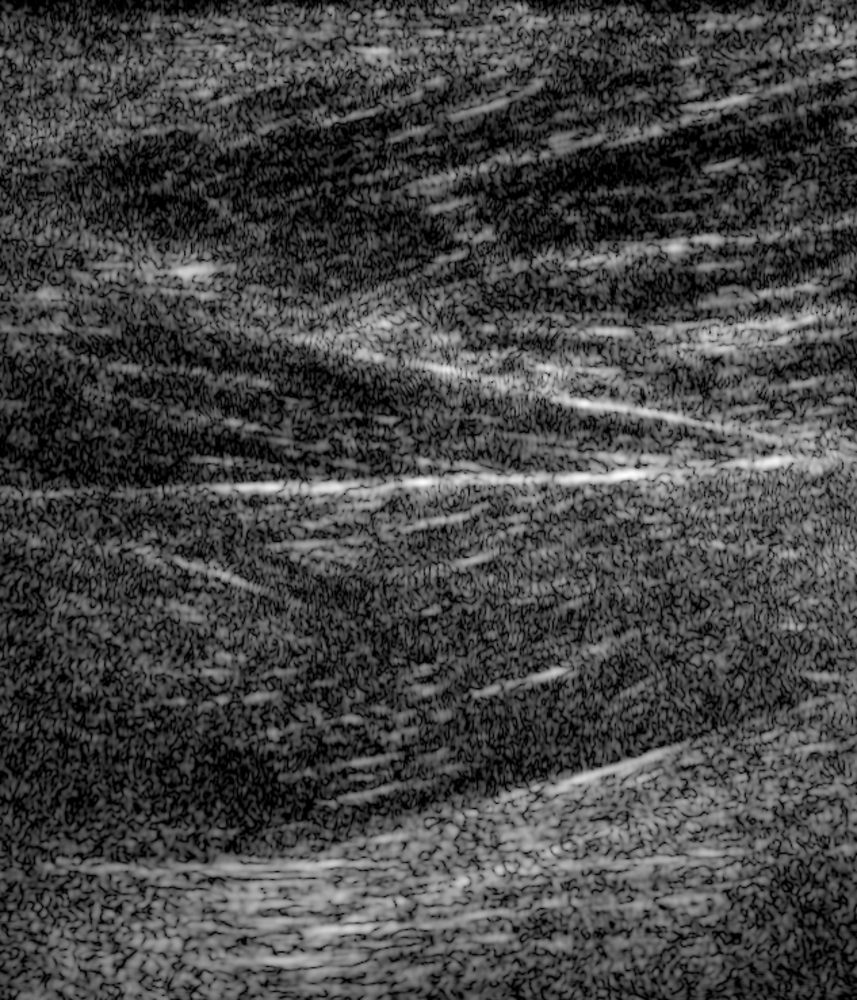

# Tracked Swept Synthetic Aperture Ultrasound Datasets

## Dataset Description

This dataset contains tracked swept synthetic aperture (SSA) ultrasound acquisitions from three targets: a 2D ATS 539 multipurpose imaging phantom, a 3D ultrasound imaging phantom, and in-vivo quadriceps muscle from healthy volunteer participants.

The data were acquired using a Verasonics Vantage research ultrasound system with a P4-2 phased array transducer. The dataset includes raw RF channel data, acquisition parameters, probe geometry, transmit information, and frame-wise tracked probe pose metadata.

The purpose of this dataset is to provide reproducible examples for generalized ultrasound reconstruction, with a particular focus on motion-compensated tracked SSA reconstruction using the zea/OpenH-RF data format.

The phantom acquisitions do not contain human subject data, animal data, or protected health information (PHI). The in-vivo acquisitions were collected from healthy volunteer participants and de-identified prior to release.

## Dataset Contributor(s)

**Contributing organization:** University of Colorado Boulder, Bottenus Lab

**Contributors:**

- Anet Sanchez
- Nick Bottenus

## Dataset Creation Date

Data were collected between 08/23/2024 and 06/30/2026.

## License / Terms of Use

This dataset is released under the Creative Commons Attribution 4.0 International License (CC BY 4.0).

The phantom data consist exclusively of phantom ultrasound acquisitions and are cleared for release under CC BY 4.0. The in-vivo data were collected under institutional approval and have been de-identified prior to release. No protected health information (PHI) is included in the released files.

## Intended Usage

This dataset is intended for research on generalized ultrasound reconstruction, with a specific focus on tracked swept synthetic aperture imaging, motion-compensated beamforming, coherent compounding, and ultrasound image-quality evaluation.

For SSA reconstruction, each raw RF frame is beamformed using its corresponding tracked transducer pose. The resulting beamformed frames are placed on a common reconstruction grid and coherently summed to synthesize a larger effective aperture. Because the reconstruction relies on coherent compounding, summation is performed before envelope detection, normalization, and log compression.

## Dataset Characterization

The dataset includes acquisitions from three targets:

- 2D ATS 539 multipurpose imaging phantom
- 3D ultrasound imaging phantom
- In-vivo quadriceps muscle from healthy volunteer participants

The ATS 539 multipurpose imaging phantom contains:

- Wire targets
- Cylindrical lesions
- Tissue-mimicking speckle regions

These targets may be used to assess spatial resolution, contrast, lesion visibility, and speckle characteristics.

### Data Collection Method

Each acquisition consisted of a freehand sweep in the lateral direciton of the transducer.
All 64 array elements were used during receive. Diverging waves were generated using a negative virtual source while activating the 20 central array elements during transmit.
For in-vivo targets the transducer was manually swept along the longitudinal direction of the quadriceps while transmitting diverging waves at 400 Hz. 
The transducer was optically tracked using an NDI Polaris Vega® XT optical tracking system manufactured by Northern Digital Inc., Ontario, Canada.

### Labeling Method

None (N/A).

### Acquisition System

- Verasonics Vantage research ultrasound scanner
- Verasonics P4-2 phased array transducer
- 64 elements
- Reconstruction center frequency: 2.5 MHz
- Sampling frequency: 10 MHz
- Optical tracking: NDI Polaris Vega XT

---

## Dataset Format

The dataset is distributed in the zea/OpenH-RF HDF5 format.

Each file includes:

- Raw RF channel data
- Sampling and center frequencies
- Transmit delays and apodization
- Transmit origins
- Probe geometry
- Sound-speed information
- Frame-wise tracked probe translations
- Frame-wise tracked probe rotations

The stored RF channel data have not been beamformed, demodulated, envelope detected, normalized, or log compressed. These processing steps are performed by the accompanying reconstruction pipeline.

## Dataset Quantification

- Number of phantom objects: 2
- Number of volunteer participants: 7
- Number of acquisitions: 62
- Number of RF frames per acquisition: 1200–1600
- Number of transmit events per frame: 1
- Number of receive elements: 64
- Number of active transmit elements: 20

### Per-acquisition contents

| Feature | Shape | Data type | Units | Description |
|---|---:|---|---|---|
| Raw RF data | `n_frames × n_tx × n_ax × n_elements × n_channels` | `float32` | acquisition units | Raw RF channel measurements |
| Probe translation | `n_frames × 3` | `float32` | m | Frame-wise tracked probe position |
| Probe rotation | `n_frames × 4` | `float32` | unit quaternion | Frame-wise tracked probe orientation in `xyzw` order |
| Probe geometry | `64 × 3` | `float32` | m | Array-element coordinates |
| Transmit origins | `n_tx × 3` | `float32` | m | Diverging-wave virtual-source coordinates |
| Transmit delays | `n_tx × 64` | `float32` | s | Per-element transmit delays |
| Transmit apodization | `n_tx × 64` | `float32` | unitless | Per-element transmit activation and weighting |

## Subject Metadata

This dataset contains acquisitions from two ultrasound imaging phantoms and healthy volunteer participants.

- Subject types: 2D imaging phantom, 3D phantom, and in-vivo human ultrasound data
- 2D phantom model: ATS 539
- 2D phantom target types: wires, cylindrical lesions, and tissue-mimicking speckle
- In-vivo anatomical region: quadriceps muscle
- Human participants: healthy volunteer participants for the in-vivo dataset
- Animal subjects: None
- Protected health information: None
- Scanner: Verasonics Vantage
- Probe: Verasonics P4-2 phased array

## Data Validation

The submission includes a `zea.Pipeline` that reconstructs representative tracked SSA B-mode images from the raw RF channel data.

The pipeline performs:

1. Frame-wise demodulation
2. Application of the tracked probe pose
3. Delay-and-sum beamforming onto a common reconstruction grid
4. Coherent SSA compounding
5. Envelope detection
6. Normalization
7. Log compression

The reconstruction is defined in `pipeline.yaml` and executed using `reconstruct.py`. Representative reconstructed B-mode images are included with the dataset.

A representative reconstructed in-vivo B-mode image is included at [`assets/main_bmode.png`](./assets/main_bmode.png).

## Known Issues

- Optical tracking measurements may contain small position and orientation uncertainties.
- Reconstruction quality depends on tracking calibration accuracy and coherent alignment between frames.
- The in-vivo dataset is intended for research use and has not been optimized for clinical workflows.

## Ethical Considerations

The phantom acquisitions contain phantom ultrasound data only. They do not contain human participants, animal subjects, personal identifiers, clinical records, or protected health information.

Human-subject consent and institutional review board approval are not applicable to the phantom acquisitions.

The in-vivo data were acquired from volunteer participants with informed consent under IRB-approved protocol #24-0176.

All released in-vivo data have been de-identified. No protected health information or participant-identifying metadata are included.

