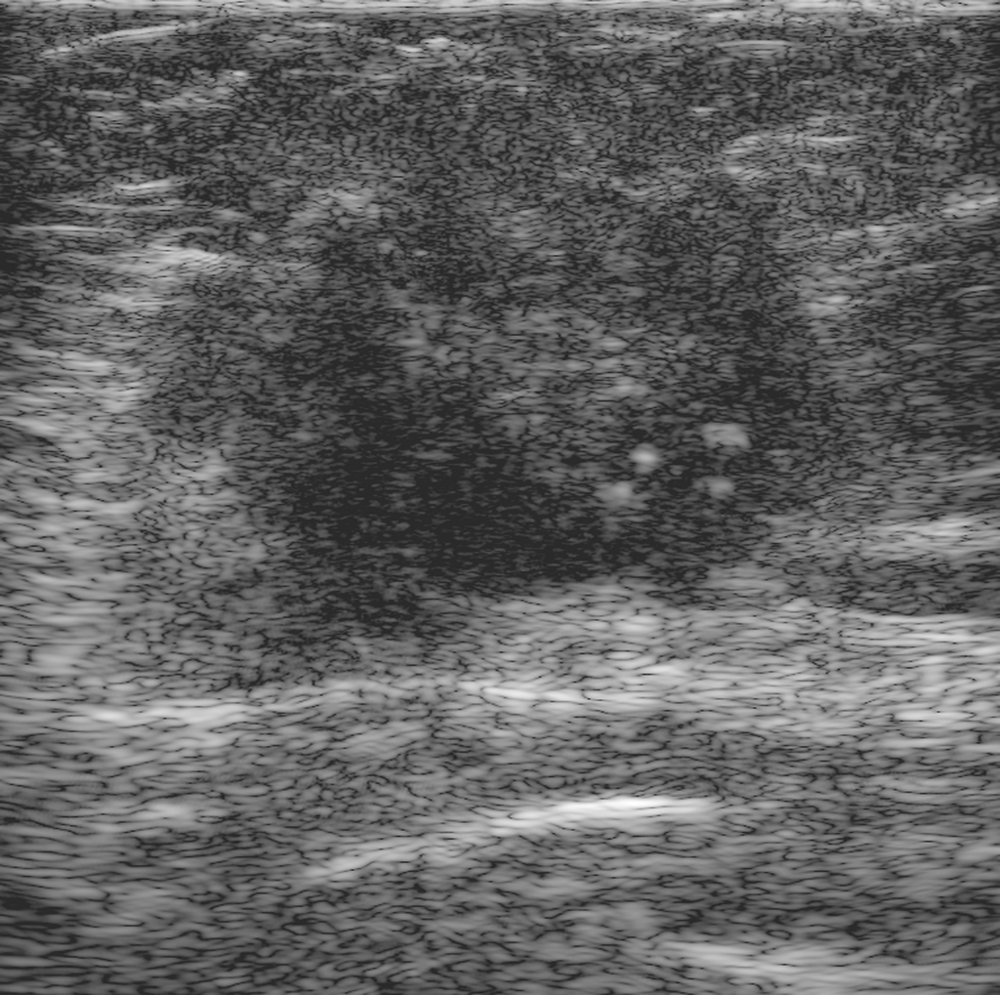

# Breast OpenH-RF

*An in-vivo human breast plane-wave raw-channel ultrasound sub-dataset for the OpenH-RF foundation initiative.*



Delay-and-sum reconstruction of the raw RF channel data in `data/S01_D1.hdf5`. Produced by `reconstruct.py`.

## Dataset Description

Breast OpenH-RF contains pre-beamformed RF channel-capture data from in-vivo breast ultrasound exams performed on a clinical, FDA-cleared scanner. Every acquisition is a 9-angle plane-wave compounding sequence with a 192-element linear array, paired with a B-mode reference image and a clinically verified diagnostic label. The intended research contribution is two-fold: (1) provide a clinically-grounded benchmark for **sound-speed and attenuation imaging** (Section 6.3 of the RFP) on real human breast tissue with biopsy-proven outcomes and (2) supply a high-quality plane-wave compounding corpus for **generalized reconstruction** research (Section 6.1: super-resolution, aberration correction, adaptive transmit design). Pathology and BI-RADS labels additionally enable benchmarking of **ultrasound interpretation** (Section 6.5).

## Dataset Contributor(s)

- **Lead PI:** Prof. Hyeon-Min Bae — KAIST, School of Electrical Engineering
- **Co-investigators (KAIST / Barreleye Inc.):** Seok-Hwan Oh, Myeong-Gee Kim, Young-Min Kim, HyeonJik Lee
- **Clinical co-investigator:** Hyuk-sool Kwon — Seoul National University Bundang Hospital (SNUBH)
- **Primary point of contact:** Seok-Hwan Oh (Barreleye Inc., Korea) — shoh@barreleye.co.kr

## Dataset Creation Date

06/30/2026

## License / Terms of Use

**CC BY 4.0** ([Creative Commons Attribution 4.0 International](https://creativecommons.org/licenses/by/4.0/)).

## Intended Usage

Quantitative imaging (sound-speed / attenuation estimation), generalized reconstruction (plane-wave compounding, aberration correction), and lesion interpretation (benign / malignant classification) on raw breast channel data with biopsy and radiology-proven labels.

## Dataset Characterization

- **Data collection method:** **Clinical**, in-vivo, human.
- **Labeling method:** Human-annotated, adjudicated by an experienced breast radiologist.
  - *Malignant* — pathology-proven via core needle or surgical biopsy.
  - *Benign* — either pathology-proven OR imaging-classified benign with **12-month follow-up showing consistent benignity**.
- **Acquisition system:**
  - Scanner: clinical, FDA-cleared ultrasound scanner.
  - Probe: **192-element linear array**, pitch **0.01993 cm**, centre frequency **10 MHz**.
  - ADC sampling: **62.5 MHz**, exported as float32.
  - Transmit: 9-angle plane-wave compounding at **[-15, -10, -5, -2.5, 0, +2.5, +5, +10, +15]°**.

## Dataset Format

All data is delivered in the **zea HDF5** format (OpenH-RF spec). One HDF5 file per acquisition; one image track per file.

```
hdf5/
└── original/                 # raw, real-valued RF channel data (n_ch = 1)
    ├── S01_D1.hdf5
    └── ...
```

**`original/` — raw RF channel data.**
- **Channel reordering** of the scanner's raw export into the OpenH-RF convention `(n_frames=1, n_tx=9, n_ax=Ns, n_el=192, n_ch=1)`.
- No demodulation, decimation, band-pass filtering, or value clipping — `raw_data` is bit-faithful to the scanner export.


## Dataset Quantification

**Current OpenH-RF release:** 70 HDF5 files; 802.10 MB (802,095,104 bytes) stored; root `zea_version` **0.1.6**. Sizes include all HDF5 contents and use decimal units (MB = 10^6 bytes, GB = 10^9 bytes, TB = 10^12 bytes), not decoded-array memory or original-source download sizes.

- **Subjects:** 35 (S01–S35, all female; age groups in *Subject Metadata*).
- **Acquisitions:** 70 (2 repeat acquisitions per subject, named `<patient>_D1` / `<patient>_D2`).
- **HDF5 files:** 70 (one file per acquisition in `hdf5/original/`).
- **RF frames:** 70 (one acquired frame per acquisition).
- **Angled transmits:** 70 × 9 = 630.
- **Stored HDF5 size:** 802.10 MB (802,095,104 bytes).
- **Train / validation / test split:** Not pre-split. Use **subject-level grouping** (both `_D1` and `_D2` of a subject in the same fold) to prevent leakage.

Per-acquisition feature table (one row per HDF5):

| Field | Shape | dtype | Units | Description |
|---|---|---|-------|---|
| `data.raw_data` | `(1, 9, Ns, 192, 1)` | float32 | —     | Raw RF channel data (`n_ch=1`); `Ns ∈ {3520, 3904, 4352}` by imaging depth |
| `data.image.values` | `(1, H, W, 1)` | uint8 | —     | Reference B-mode (e.g. `(1, 650, 620, 1)`) |
| `data.image.coordinates` | `(H, W, 3)` | float32 | m     | Per-pixel (x, y, z) for the B-mode |
| `scan.sampling_frequency` | scalar | float32 | Hz    | 62.5e6 |
| `scan.center_frequency` | scalar | float32 | Hz    | 10e6 |
| `scan.demodulation_frequency` | scalar | float32 | Hz    | 6e6 (echo-spectrum peak after tissue attenuation) |
| `scan.sound_speed` | scalar | float32 | m/s   | 1540.0 (conventional default; revise for SoS-imaging research) |
| `scan.initial_times` | `(9,)` | float32 | s     | Per-angle timing offset |
| `scan.t0_delays` | `(9, 192)` | float32 | s     | Per-element transmit delays, all ≥ 0 |
| `scan.polar_angles` | `(9,)` | float32 | rad   | [-15..+15]° in radians |
| `scan.focus_distances` | `(9,)` | float32 | m     | All zero — plane wave |
| `scan.tx_apodizations` | `(9, 192)` | float32 | —     | Full aperture (all ones) |
| `scan.transmit_origins` | `(9, 3)` | float32 | m     | All zero |
| `probe.probe_geometry` | `(192, 3)` | float32 | m     | Element x-positions (linear array) |
| `metadata.subject.id` | scalar | str | —     | De-identified patient ID, e.g. `"S01"` (patient-level, shared by both acquisitions) |
| `metadata.subject.sex` | scalar | str | —     | `"F"` (cohort is all female) |
| `metadata.annotations.anatomy` | scalar | str | —     | `"breast"` |
| `metadata.annotations.label` | scalar | str | —     | `"malignant"` or `"benign"` |
| `metadata.text_report` | scalar | str | —     | BI-RADS category + pathology subtype + acquisition index (D1/D2) |

## Subject Metadata

Per-file metadata follows the **HIPAA Safe-Harbor** approach: only **de-identified subject ID, sex, anatomy, binary label, BI-RADS, pathology subtype** are stored. Free-text identifiers, exact age, exact lesion size, and exam dates are deliberately **omitted from the HDF5 files**. 

- **Number of subjects:** 35
- **Sex distribution:** 100% female (35/35)
- **Age groups (decade-binned):**

| Age group | Count | % |
|---|---|---|
| 20-29 | 2  | 5.7% |
| 30-39 | 4  | 11.4% |
| 40-49 | 12 | 34.3% |
| 50-59 | 8  | 22.9% |
| 60-69 | 5  | 14.3% |
| 70-79 | 3  | 8.6% |
| 80-89 | 1  | 2.9% |

- **Case status:** 22 benign (62.9%) / 13 malignant (37.1%)
- **BI-RADS distribution:**

| BI-RADS | Count | % |
|---|---|---|
| C2 | 8  | 22.9% |
| C3 | 5  | 14.3% |
| C4a | 11 | 31.4% |
| C4b | 2  | 5.7% |
| C5 | 2  | 5.7% |
| C6 | 7  | 20.0% |

- **Lesion size (longest axis, cm):** n=35, min 0.50, max 5.20, mean 1.40, median 1.00.

| Lesion size | Count |
|---|---|
| < 1.0 cm | 14 |
| 1.0 – 2.0 cm | 13 |
| 2.0 – 3.0 cm | 5  |
| ≥ 3.0 cm | 3  |

- **Histopathology subtypes:**
  - *Malignant (n=13):* IDC (8), DCIS (4), ADH (1)
  - *Benign (n=22):* FA (9), IDP (3), FCC (1), Usual Ductal Hyperplasia (1), unspecified / NA (8)
- **Anatomical region:** Breast (left and right; mixed lesion locations).
- **Scanner / probe model:** Clinical FDA-cleared scanner with a 192-element linear 10 MHz probe.

## Acquisition & Reconstruction Conventions

Plane-wave transmit beamforming is used, with all 192 elements activated on each transmit.

- **Demodulation frequency.** The post-tissue echo spectrum peaks near 6 MHz (the 10 MHz nameplate centre lies in the attenuated tail), so `demodulation_frequency = 6 MHz` keeps signal energy inside the IQ baseband.

## Data Validation

A reference reconstruction is provided in [`reconstruct.py`](reconstruct.py). It defines the DAS pipeline directly in code (via zea ops) and applies, to the raw RF channel data:

```
cast(float32) → band-pass filter (1–12 MHz) → demodulate → DAS beamform → envelope detect → normalize → log compression
```

The 1–12 MHz band-pass rejects a persistent sub-MHz band before coherent beamforming, which allows to produce a clean B-mode directly from the raw RF. Run it to reproduce a reference B-mode from any delivered file:

```bash
python reconstruct.py --input hdf5/original/S01_D1.hdf5     # single file
python reconstruct.py --compare S01_D1                      # DAS vs. scanner reference B-mode
```

`python reconstruct.py --save-yaml` exports the pipeline as `pipeline.yaml` if a shareable recipe is needed (the script itself does not load it).

## Known Issues

- **`demodulation_frequency = 6 MHz`** is empirically tuned to the post-attenuation echo spectrum; the probe nameplate centre frequency is 10 MHz. Treat both as starting points for frequency-dependent imaging research.
- **`sound_speed = 1540 m/s`** is a conventional default.
- **ADC saturation sentinels** (`int16` ±32768 from front-end transmit blanking) are **preserved as-is** in `raw_data` to keep the tensor bit-faithful. They are concentrated in the first ~50 axial samples (≈ 0.6 mm); the reference pipeline masks this region via `zlims`, but downstream users may wish to clip or mask these values for their own processing.

## Ethical Considerations

- **Consent status:** All subjects gave informed consent under SNUBH IRB protocol **B-2401-876-301**.
- **De-identification:** No direct identifiers (name, full exam date, free-text clinical notes) are stored. Age is decade-binned at the dataset level (not stored per file); exact lesion size and exam dates are not stored per file; only the acquisition year (2024) is reported. Subject IDs are coded (`S01`…`S35`).
- **IRB approval:** SNUBH IRB **B-2401-876-301** 
- **Animal welfare (ARRIVE 2.0):** Not applicable — human-only dataset.
