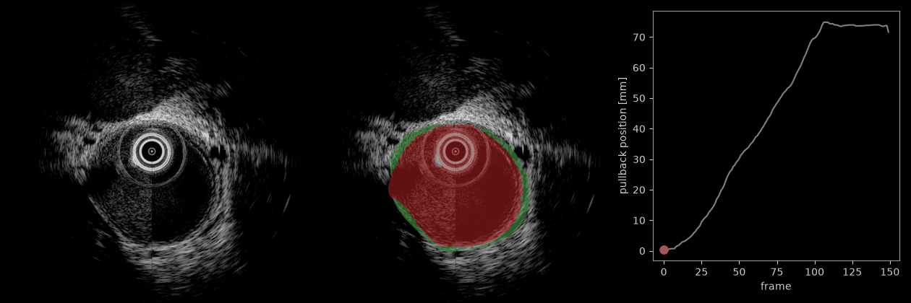
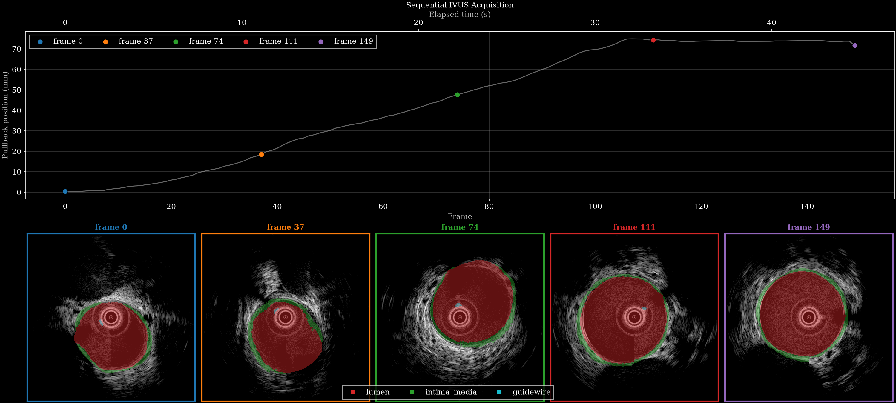

# Data Card — Mosaic Intelligence / NuevoSono in-vivo IVUS

*In-vivo intravascular ultrasound raw-channel acquisitions from a porcine study, with lumen, intima-media and guidewire segmentation.*

Pullback through
[`22_12_10_52.hdf5`](https://huggingface.co/datasets/nvidia/OpenH-RF/blob/main/mosaic-intelligence/data/22_12_10_52.hdf5),
reconstructed from the raw channel data. Left to right: B-mode, the same frame with the
lumen and intima-media segmentation, and the linear-encoder pullback position with the
current frame marked. Below, five frames from the same acquisition. Both produced by
`reconstruct.py`.

Nine in-vivo intravascular ultrasound (IVUS) acquisitions from a porcine study, each
in the *zea* file format with per-frame lumen, intima-media and guidewire segmentation.
Per-acquisition dimensions are in [Acquisitions](#acquisitions).

## Dataset Description

Each dataset is an IVUS acquisition collected in a porcine animal study. The source data consists of raw IVUS RF frames and a pre-computed (scan-converted) B-mode image. Six of the acquisitions have time-sampled linear encoder pullback positions of the IVUS probe at each frame. For each acquisition and for every frame, per-class segmentation masks are provided for the vessel lumen, intima-media, and guidewire.

## Dataset Contributors

Mosaic Intelligence Labs in collaboration with NuevoSono

Primary points of contact:
Brian Boitnott (1): brian@mosaicintelligence.xyz
Ali Mackanic (1): ali@mosaicintelligence.xyz

## Dataset Creation Date

07/17/2026

## License / Terms of Use

All contributed data, labels, and metadata is released by Mosaic Intelligence Labs
and NuevoSono under CC BY 4.0.
Pre-existing hardware, software, simulation, and platform intellectual property
remain the property of their respective owners. The team agrees to comply with
OpenH-RF governance, publication, and data-sharing policies. The license is also
recorded in each file's `metadata/credit` field.

## Intended Usage

Intended for IVUS tracking and segmentation applications, including lesion
detection and image-guided intervention.

## Dataset Characterization

- **Data Collection Method:** Porcine (in-vivo animal study)
- **Labeling Method:** derived tracking metadata, semi-automated labeling
- **Acquisition System:** Single-element IVUS, center frequency 30 MHz,
  sampling rate 1 GHz

## Dataset Format

All acquisitions are submitted in the *zea* file format. The RF data is stored as
a rotational sequence of A-lines (`n_tx` transmits per frame, one element/channel);
the accompanying B-mode `image` and `segmentation` masks are pre-computed,
scan-converted Cartesian frames sharing a per-pixel coordinate grid.

### Shared per-sample schema

Fields that are in every acquisition:

| Group / field | Shape | Dtype | Units | Description |
|---|---|---|---|---|
| `data/raw_data` | `[n_frames, n_tx, n_ax, 1, 1]` | float32 | source RF units | Raw IVUS RF frames (single element / channel) |
| `data/image/values` | `[n_frames, H, W]` | uint8 | — | Pre-computed (scan-converted) B-mode image |
| `data/image/coordinates` | `[H, W, 3]` | float32 | m | Per-pixel Cartesian positions `(x, y, z)`; cross-section lies in the x-y plane, `z = 0` |
| `data/segmentation/values` | `[n_frames, H, W, n_labels]` | bool | — | Per-class boolean segmentation masks (one channel per label) |
| `data/segmentation/coordinates` | `[H, W, 3]` | float32 | m | Same per-pixel grid as `image/coordinates` |
| `data/segmentation/labels` | `[n_labels]` | str | — | Channel names: `background`, `lumen`, `intima_media`, `guidewire` |
| `scan/*` | — | mixed | Hz / s / rad / m | Scan metadata (`sampling_frequency`, `center_frequency`, `demodulation_frequency`, `polar_angles`, `t0_delays`, `tx_apodizations`, `focus_distances`, `transmit_origins`, `initial_times`) |
| `probe/name` | scalar | str | — | Probe name (`NuevoSono IVUS`) |
| `probe/type` | scalar | str | — | Probe geometry type (`custom`) |
| `probe/probe_geometry` | `[1, 3]` | float32 | m | Element position (single element at the origin) |
| `probe/probe_center_frequency` | scalar | float32 | Hz | Nominal center frequency (30 MHz) |
| `metadata/subject/{id, type}` | scalar | str | — | Subject identifier (`porcine_<acq>`) and type (`animal`) |
| `metadata/credit` | scalar | str | — | Attribution: `Mosaic Intelligence - NuevoSono IVUS porcine dataset (CC BY 4.0)` |
| `metadata/text_report` | scalar | str | — | transducer rotation direction |
| `metadata/rotation/{samples, sampling_frequency, start_time_offset}` | `[1]` / scalar / scalar | float32 | — / Hz / s | Transducer rotation: `samples = +1` clockwise, `-1` counterclockwise |
| `metadata/pullback_position/{samples, sampling_frequency, start_time_offset}` | `[n_frames]` / scalar / scalar | float32 | m / Hz / s | Linear encoder pullback position per frame (**tracked acquisitions only**) |

## Acquisitions

Nine acquisitions sharing the schema above: `n_ax = 8192`, `n_el = 1`, and four
segmentation labels (`background`, `lumen`, `intima_media`, `guidewire`). The `15_*`
acquisitions are untracked, rotate counterclockwise and use a non-square image grid;
the `22_*` are tracked with a linear-encoder pullback and rotate clockwise.

| Acquisition | Tracked | Frames | Transmits | Image grid | Frame rate | Size |
|---|---|---:|---:|---|---:|---:|
| `15_10_18_21` | no | 100 | 540 | 985x986 | 3.33 Hz | 1.46 GB |
| `15_10_50_19` | no | 60 | 360 | 985x986 | 3.33 Hz | 592.12 MB |
| `15_16_45_06` | no | 100 | 540 | 985x986 | 3.33 Hz | 1.46 GB |
| `22_12_10_52` | yes | 150 | 540 | 2048x2048 | 3.33 Hz | 2.36 GB |
| `22_12_29_46` | yes | 100 | 540 | 2048x2048 | 8.33 Hz | 1.60 GB |
| `22_12_38_45` | yes | 150 | 360 | 2048x2048 | 8.33 Hz | 1.58 GB |
| `22_13_10_16` | yes | 100 | 540 | 2048x2048 | 8.33 Hz | 1.54 GB |
| `22_13_56_43` | yes | 100 | 540 | 2048x2048 | 8.33 Hz | 1.53 GB |
| `22_14_29_54` | yes | 150 | 360 | 2048x2048 | 3.33 Hz | 1.65 GB |

## Dataset Quantification

9 HDF5 files; 13.76 GB (13,756,334,080 bytes) stored; root `zea_version` **0.1.6**. Sizes include all HDF5 contents and use decimal units (MB = 10^6 bytes, GB = 10^9 bytes, TB = 10^12 bytes), not decoded-array memory or original-source download sizes.

- Acquisitions: 9 (3 untracked `15_*`, 6 tracked `22_*`)
- Frames per acquisition: 60–150 (1010 frames total across all acquisitions)
- Frame rate: ~3.33 Hz or ~8.33 Hz depending on acquisition (see the table above)
- Train / validation / test split: N/A
- **Stored HDF5 size:** 13.76 GB (13,756,334,080 bytes).

| Acquisition | Frames | `n_tx` | `H x W` | Frame rate | Rotation | Tracking | Size |
|---|---|---|---|---|---|---|---|
| `15_10_18_21` | 100 | 540 | 985 x 986 | ~3.33 Hz | counterclockwise | untracked | 1.46 GB |
| `15_10_50_19` | 60 | 360 | 985 x 986 | ~3.33 Hz | counterclockwise | untracked | 592.12 MB |
| `15_16_45_06` | 100 | 540 | 985 x 986 | ~3.33 Hz | counterclockwise | untracked | 1.46 GB |
| `22_12_10_52` | 150 | 540 | 2048 x 2048 | ~3.33 Hz | clockwise | tracked | 2.36 GB |
| `22_12_29_46` | 100 | 540 | 2048 x 2048 | ~8.33 Hz | clockwise | tracked | 1.60 GB |
| `22_12_38_45` | 150 | 360 | 2048 x 2048 | ~8.33 Hz | clockwise | tracked | 1.58 GB |
| `22_13_10_16` | 100 | 540 | 2048 x 2048 | ~8.33 Hz | clockwise | tracked | 1.54 GB |
| `22_13_56_43` | 100 | 540 | 2048 x 2048 | ~8.33 Hz | clockwise | tracked | 1.53 GB |
| `22_14_29_54` | 150 | 360 | 2048 x 2048 | ~3.33 Hz | clockwise | tracked | 1.65 GB |

## Subject Metadata

Animal study data — no human subjects.

## Data Validation

A `zea.Pipeline` reconstructs the IVUS B-mode from the raw channel data
(RF → envelope → normalization → log compression → scan conversion). See
[reconstruct.py](reconstruct.py) and [pipeline.yaml](pipeline.yaml). Linear encoder position (when applicable) and segmentation masks are overlayed on the B-modes.

## Known Issues

- Untracked (`15_*`) acquisitions have no `pullback_position`, so the pullback
  trajectory panel is omitted during reconstruction.

## Ethical Considerations

Porcine animal study data only; contains no human subjects or PHI. Collected and
released in compliance with applicable institutional animal care approvals and
OpenH-RF governance and data-sharing policies.
