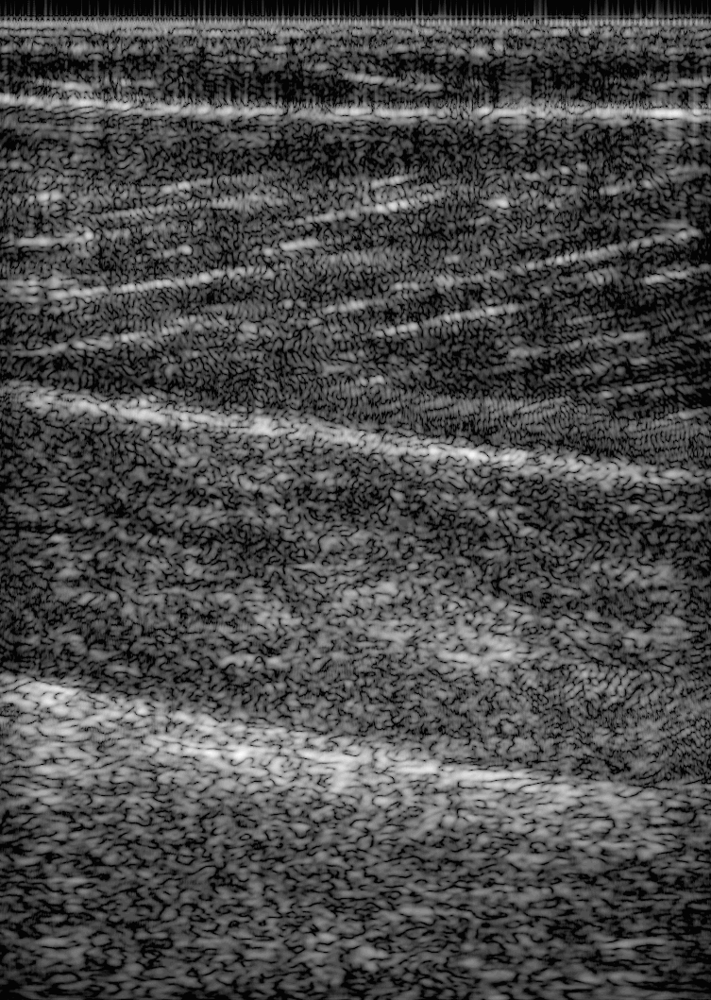

# PoliTO High Frame Rate Fascicle Tracking



*Cine loop of treadmill walking at 2 km/h,
[`data/PAT02/PAT02_w1.hdf5`](https://huggingface.co/datasets/nvidia/OpenH-RF/blob/main/politorino/data/PAT02/PAT02_w1.hdf5),
reconstructed from the raw channel data with the `pipeline.yaml` in this folder.*

## Dataset Description

The dataset comprises in-vivo human musculoskeletal raw ultrasound data during dynamic tasks. It includes the acquisition of the medial gastrocnemius on 5 healthy volunteers  during heel raises and treadmill walking. The data is acquired with a Verasonics Vantage 256 research platform and a 128-element linear array probe (L11-5v) at 500 fps for 9.6 s per acquisition. Each subject was imaged during six task conditions: cyclical heel raises and drops at a fixed frequency provided by a metronome at 60 (hr1), 90 (hr2), and 120 bpm (hr3) and walking at 2 (w1), 4 (w2), and 5 (w3) km/h. We provide the raw data, the beamformed DAS and FDMAS images, and the automated fascicle tracking obtained with UltraTimTrack (https://github.com/timvanderzee/UltraTimTrack). The tracking data was obtained on the first 9s of sub-sampled .mp4 videos at three frame rates: 25 fps, 50 fps and 125 fps. The tracking data is provided for each frame rate and a Python code is provided to correctly visualize the data on the reconstructed images.  **Data type: in-vivo**

## Dataset Contributor(s)

Personnel involved in raw data acquisition, beamforming, annotation, dataset preparation and analysis:

- E. Cesti
- M. Carbonaro
- M. Boccardo
- F. Truscello
- S. Seoni
- G.L. Cerone
- K.M. Meiburger
- G. Bardoscia
- B.J. Raiteri
- A. Botter

## Dataset Creation Date

12/2023

## License / Terms of Use

[Creative Commons Attribution 4.0 International (CC BY 4.0)](https://creativecommons.org/licenses/by/4.0/legalcode.en).
Retain attribution and identify modifications when reusing the data.

## Intended Usage

This data was employed for an initial study evaluating fascicle tracking algorithms during different dynamic tasks : “Ultrasound-based methods to track skeletal muscle architecture in dynamic tasks: a comparative study” by Elena Cesti et. al to be published in IEEE Transactions on Neural Systems and Rehabilitation Engineering (2026 - under review and on first round of revisions in July 2026)

## Dataset Characterization

- **Data Collection Method:** in-vivo human musculoskeletal
- **Labeling Method:** derived fascicle tracking from UltraTimTrack
- **Acquisition system:** 128-element linear array (L11-5v),
  sampling 31.25 MHz, center frequency 7.6 MHz

## Processing the Dataset

The acquisitions can be processed with the `reconstruct.py` [script](https://github.com/open-h/OpenH-RF/blob/main/datasets/politorino/reconstruct.py) as provided in the [OpenH-RF GitHub repository](https://github.com/open-h/OpenH-RF), together with the `pipeline.yaml` definition in this folder and the [zea library](https://github.com/tue-bmd/zea). The script streams the data from the Hugging Face Hub.

The script reconstructs a B-mode from the raw channel data and overlays
the stored fascicle tracking on it, writing a `.png`. The constants at the top of
the script select what is drawn:

- `FRAME` -- index of the acquisition frame to reconstruct
- `FPS` -- which stored tracking rate to overlay (25, 50 or 125 fps)
- `TRACK_INDEX` -- index of the tracking sample within that rate

## Dataset Format

[zea v0.1.6](https://github.com/tue-bmd/zea)

Submitted in the [`zea` file format](https://zea.readthedocs.io/en/latest/)
(one HDF5 file per acquisition).

Per-sample contents of the HDF5:

| Group / field | Shape | Dtype | Units | Description |
|---|---|---|---|---|
| `data/raw_data` | `[n_frames, n_tx, n_ax, n_el, n_ch]` | int16 | -- | Raw channel data |
| `data/raw_data/image_das` | `[n_frames, z, x]` (+ `coordinates` `[n_frames, z, x, 3]`) | uint8 | dB | DAS B-mode (log-compressed) |
| `data/raw_data/image_fdmas` | `[n_frames, z, x]` (+ `coordinates` `[n_frames, z, x, 3]`) | uint8 | dB | FDMAS B-mode (log-compressed) |
| `scan` | -- | -- | -- | center/demodulation/sampling frequency, t0, sound speed, time_to_next_transmit |
| `probe` | -- | -- | -- | element width, probe_center_frequency, probe_geometry |
| `metadata/tracking_` | -- | -- | -- | Tracking data as saved by UltraTimTrack |

## Dataset Quantification

**Current OpenH-RF release:** 30 HDF5 files; 169.95 GB (169,950,314,496 bytes) stored; root `zea_version` **0.1.6**. Sizes include all HDF5 contents and use decimal units (MB = 10^6 bytes, GB = 10^9 bytes, TB = 10^12 bytes), not decoded-array memory or original-source download sizes.

- 30 files - 6 acquisitions of 9.6s at 500 fps for each of the 5 subjects
- **Stored HDF5 size:** 169.95 GB (169,950,314,496 bytes); 5.67 GB per file on average. Individual file sizes vary.

## Subject Metadata

Five healthy subjects (2 men, 3 women; (mean ± SD) age: 25.6 ± 1.3 yr, height:  1.78 ± 0.06 m, weight: 67 ± 11 kg) were recruited. All data were acquired with the same Verasonics system and probe. 

## Data Validation

`reconstruct.py` builds a `zea.Pipeline` of DAS beamforming →
envelope detection → normalization → log-compression **in code** and reconstructs
a B-mode directly from `raw_data` — showing the raw-to-image flow without any
config file. It contains also the code employed to view the plotting of the tracking data. It also saves the pipeline to `pipeline.yaml` as a
shareable recipe. 

## Known Issues

- The tracking data for three subjects (PAT01, PAT04, PAT05) were obtained on the reconstructed images after a horizontal flip. This is noted in the file and the provided code to view the tracking data automatically checks for this and flips the data, if needed. 
- The tracking data covers the first 9s out of the provided 9.6s of the raw data.
- There is a small offset in depth between the reconstructed data used for the tracking and the raw data. The `reconstruct.py` code provides the correction at lines 233-240.

## Ethical Considerations

The study was conducted in accordance with the Declaration of Helsinki and the procedure approved by the Institutional Ethics Committee of Politecnico di Torino (reference number: 2772/2025). Informed consent was obtained from all participants after receiving detailed explanation of the study procedures and before participating in the study. 

## Citation

```bibtex
@article{US_FascicleTracking_2026,
  title={Ultrasound-based methods to track skeletal muscle architecture in dynamic tasks: a comparative study},
  author={Cesti, E., Carbonaro, M., Boccardo, M., Truscello, F., Seoni, S., Cerone, G.L., Meiburger, K.M., Raiteri, B.J. and Botter, A.},
  year={2026},
  publisher={IEEE Transactions on Neural Systems and Rehabilitation Engineering}
}
```
