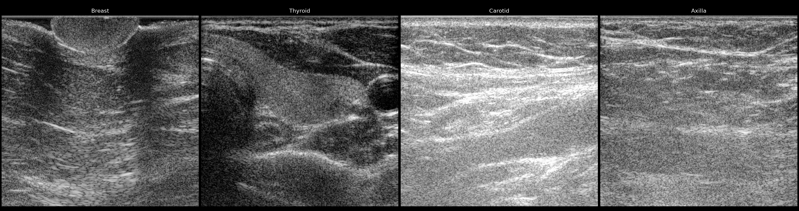
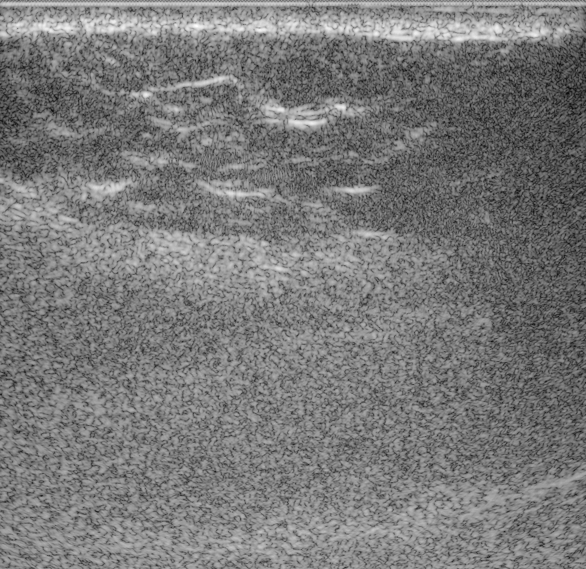

# Siemens In-vivo Raw Ultrasound Channel Data



*Four of the anatomies in this dataset, each beamformed from `data/raw_data`: [`Subject_03_acq_018`](https://huggingface.co/datasets/nvidia/OpenH-RF/blob/main/siemens-healthineers/data/Subject_03_acq_018.hdf5), [`Subject_02_acq_004`](https://huggingface.co/datasets/nvidia/OpenH-RF/blob/main/siemens-healthineers/data/Subject_02_acq_004.hdf5), [`Subject_03_acq_008`](https://huggingface.co/datasets/nvidia/OpenH-RF/blob/main/siemens-healthineers/data/Subject_03_acq_008.hdf5), [`Subject_05_acq_031`](https://huggingface.co/datasets/nvidia/OpenH-RF/blob/main/siemens-healthineers/data/Subject_05_acq_031.hdf5).*

## Dataset Description

This is an in-vivo full-synthetic-aperture (FSA) ultrasound raw channel-data dataset for research on sound speed estimation, phase aberration correction, and learned beamforming from pre-beamformed data. Each acquisition is a multi-frame FSA capture from a 180-element linear array: raw baseband IQ channel data alongside reference B-mode images. The dataset is a collection of volunteer scans including 15 adult subjects, 590 acquisitions of predominantly superficial anatomy acquired on a Siemens ACUSON Sequoia development scanner. **Data type: in-vivo human.**

## Dataset Contributor(s)

- Rickard Loftman, PhD (Siemens Healthineers, Ultrasound)
- Ismayil Guracar, MSEE <ismayil.guracar@siemens-healthineers.com> (Siemens Healthineers, Ultrasound; contact)
- Jane Bucholz, BHS (Medical Imaging); PgDip HS (Ultrasound); DMU (General); PgDip Public Health (Dist) (Siemens Healthineers, Ultrasound)
- Craig Williams, PG Dip Medical Ultrasound, BSc (Hons) Diagnostic Radiography (Siemens Healthineers, Ultrasound)
- Walter Simson, PhD (additional contributor)

## Dataset Creation Date

07/06/2026 (data card). Acquisition period: June 2025 – May 2026.

## License / Terms of Use

[Creative Commons Attribution 4.0 International (CC BY 4.0)](https://creativecommons.org/licenses/by/4.0/legalcode.en). Retain attribution and identify modifications when reusing the data.

## Intended Usage

Developing and benchmarking methods that operate on raw ultrasound channel data: learned/adaptive beamforming, and self-supervised representation learning on RF/IQ data. Subject IDs enable subject-wise splits. the reference split holds out Subject_13 and Subject_14 for validation.

## Dataset Characterization

- **Data Collection Method:** healthy adult volunteers in a non-clinical research setting.
- **Labeling Method:** human-annotated subject/anatomy metadata and per-frame quality tags (`contact`, `challenging`).
- **Acquisition system:** Siemens ACUSON Sequoia development scanner, 10L4 180-element linear array (0.201 mm pitch, 36.2 mm aperture; elements 0.2 × 9 mm); transmit center frequency 6.5 MHz; baseband IQ sampled at 13.33 MHz. Full synthetic aperture multi-static acquisition: 180 single-element transmit events per frame, all 180 elements received.

## Processing the Dataset

The acquisitions can be processed with the `pipeline.yaml` definition in this folder and the [zea library](https://github.com/tue-bmd/zea).

`zea` streams the data from the Hugging Face Hub and processes it according to the pipeline. You can try it out with the following command:

```bash
zea process \
  --dataset hf://nvidia/OpenH-RF/siemens-healthineers/data/Subject_03_acq_008.hdf5 \
  --config hf://nvidia/OpenH-RF/siemens-healthineers/pipeline.yaml
```

Alternatively, you can use the `reconstruct.py` [script](https://github.com/open-h/OpenH-RF/blob/main/datasets/siemens-healthineers/reconstruct.py) as provided in the [OpenH-RF GitHub repository](https://github.com/open-h/OpenH-RF).

## Dataset Format

[zea v0.1.6](https://github.com/tue-bmd/zea)

Packaged in the `zea` [file format](https://zea.readthedocs.io/en/openh-rf-latest/data-acquisition.html) (current release `zea_version` 0.1.6), **one HDF5 file per acquisition**:

- On-scanner quadrature demodulation to baseband IQ, demodulation frequency stored per file.
- On-scanner analog TGC and digital filtering with scaling are applied.
- FSA transmit scheme encoded explicitly (one-hot `tx_apodizations`, zero `t0_delays`, transmit origins at element positions).

Per-file contents:

| Group / field | Shape | Dtype | Units | Description |
| --- | --- | --- | --- | --- |
| `data/raw_data` | `[n_frames, 180, n_ax, 180, 2]` | float32 | – | baseband IQ channel data (transmit, fast-time, receive); last axis `[I, Q]` |
| `data/image` (+ `coordinates`) | `[n_frames, 507, 456]` | uint8 | dB | DAS B-mode reconstructed from `raw_data` by the zea pipeline (1540 m/s, log-compressed) |
| `scan/sampling_frequency`, `center_frequency`, `demodulation_frequency` | scalar | float32 | Hz | sampling, transmit, and demodulation frequencies |
| `scan/initial_times`, `t0_delays`, `tx_apodizations`, `transmit_origins`, `focus_distances`, `polar_angles`, `azimuth_angles` | per-transmit | float32 | s / – / m / rad | Full-synthetic-aperture transmit description (single-element transmits) |
| `scan/sound_speed` | scalar | float32 | m/s | Assumed sound speed (1540) |
| `scan/time_to_next_transmit` | `[n_frames, 180]` | float32 | s | Line time (pulse-repetition interval); frame interval = 180 × line time |
| `probe/probe_geometry` | `[180, 3]` | float32 | m | Element positions (x, y, z) |
| `probe/type` | str | – | – | Array type (`linear`) |
| `probe/name` | str | – | – | Transducer model (`Siemens ACUSON 10L4`) |
| `probe/probe_center_frequency` | scalar | float32 | Hz | Probe nominal centre frequency (6.5 MHz) |
| `probe/element_width` | scalar | float32 | m | Element pitch-direction width (0.2 mm) |
| `probe/element_height` | scalar | float32 | m | Element elevation size (9 mm) |
| `metadata/subject/id` | str | – | – | Anonymized subject ID (`Subject_01`–`Subject_15`) |
| `metadata/subject/type` | str | – | – | Subject type (`human`) |
| `metadata/annotations/anatomy` | str | – | – | Scanned anatomy (breast, thyroid, axilla, …) |
| `metadata/annotations/label` | str | – | – | Public acquisition ID (`Subject_XX_acq_NNN`) |
| `custom/contact` | `[n_frames]` | bool | – | Per-frame: probe in acoustic contact with the subject (False = off-subject) |
| `custom/challenging` | `[n_frames]` | bool | – | Per-frame: difficult acoustic window / view |
| `custom/iq_rms_source` | scalar | float32 | – | Source-level IQ RMS (for optional amplitude normalization) |

All spatial maps carry per-pixel Cartesian `coordinates` in meters, last axis `[x, y, z]` (y = 0 for these 2-D maps).

## Dataset Quantification

**Current OpenH-RF release:** 590 HDF5 files; 228.54 GB (228,538,449,920 bytes) stored; root `zea_version` **0.1.6**. Sizes include all HDF5 contents and use decimal units (MB = 10^6 bytes, GB = 10^9 bytes, TB = 10^12 bytes), not decoded-array memory or original-source download sizes.

- **590 acquisitions (4,539 frames) from 15 subjects**, one continuous dataset: 51 acquisitions / 411 frames (Subjects 01–03) from the first acquisition round and 539 acquisitions / 4,128 frames (Subjects 04–15) from the second.
- **File naming:** one HDF5 per acquisition, `Subject_XX_acq_NNN.hdf5` (acquisitions numbered per subject in acquisition order).
- **Stored HDF5 size:** 228.54 GB (228,538,449,920 bytes); raw IQ stored as float32 I/Q, one HDF5 per acquisition.
- Per-frame boolean quality labels support curation: `contact` and `challenging` (see feature table). Acquisitions not yet through manual review default to `contact=True, challenging=False`.

## Subject Metadata

Aggregate statistics only; files carry anonymized subject IDs, no PHI.

- **15 adult volunteers in total** (Subject_01–Subject_15).
- Acquisitions per subject (590 total): Subject_01: 12, Subject_02: 6, Subject_03: 33, Subject_04: 44, Subject_05: 41, Subject_06: 47, Subject_07: 35, Subject_08: 51, Subject_09: 44, Subject_10: 32, Subject_11: 49, Subject_12: 36, Subject_13: 36, Subject_14: 52, Subject_15: 72.
- Anatomies scanned (by acquisition): breast (284), thyroid (117), axilla (59), neck (29), abdomen (20), carotid (18), other/unlabeled (63).
- All scans are B-mode-style views (predominantly superficial anatomy) on a single probe and system; no pathology labels are asserted.

## Data Validation

[`pipeline.yaml`](pipeline.yaml). `data/image` is produced by this same pipeline at conversion time, so `reconstruct.py` reproduces it — a round-trip check that the probe geometry, transmit description, and timing are recorded correctly. Reference B-modes rendered by this pipeline are in [`assets/`](assets), and the strip at the top of this card is four of them.



Ten frames of `data/Subject_03_acq_008.hdf5`. `custom/contact` marks the first frame as off-subject — use those per-frame flags when picking frames, rather than assuming frame 0 is usable.

## Known Issues

- Time-axis length (`n_ax` = `raw_data.shape[2]`) varies per acquisition (native lengths range ~700–2270 samples); each file is stored at its own native length.
- `view_difficulty` annotations exist for the first acquisition round only.

## Ethical Considerations

The released data is anonymized and contains no protected health information (PHI). Acquisitions were performed under Siemens Healthineers internal ultrasound research safety, human-safety, and consent procedures. Metadata labels, file names, and source identifiers are screened against the HIPAA Safe Harbor standard, with GDPR-equivalent handling for any EU-origin data; this release contains no EU-origin data. The dataset is released under the CC BY 4.0 license.
