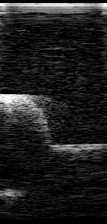
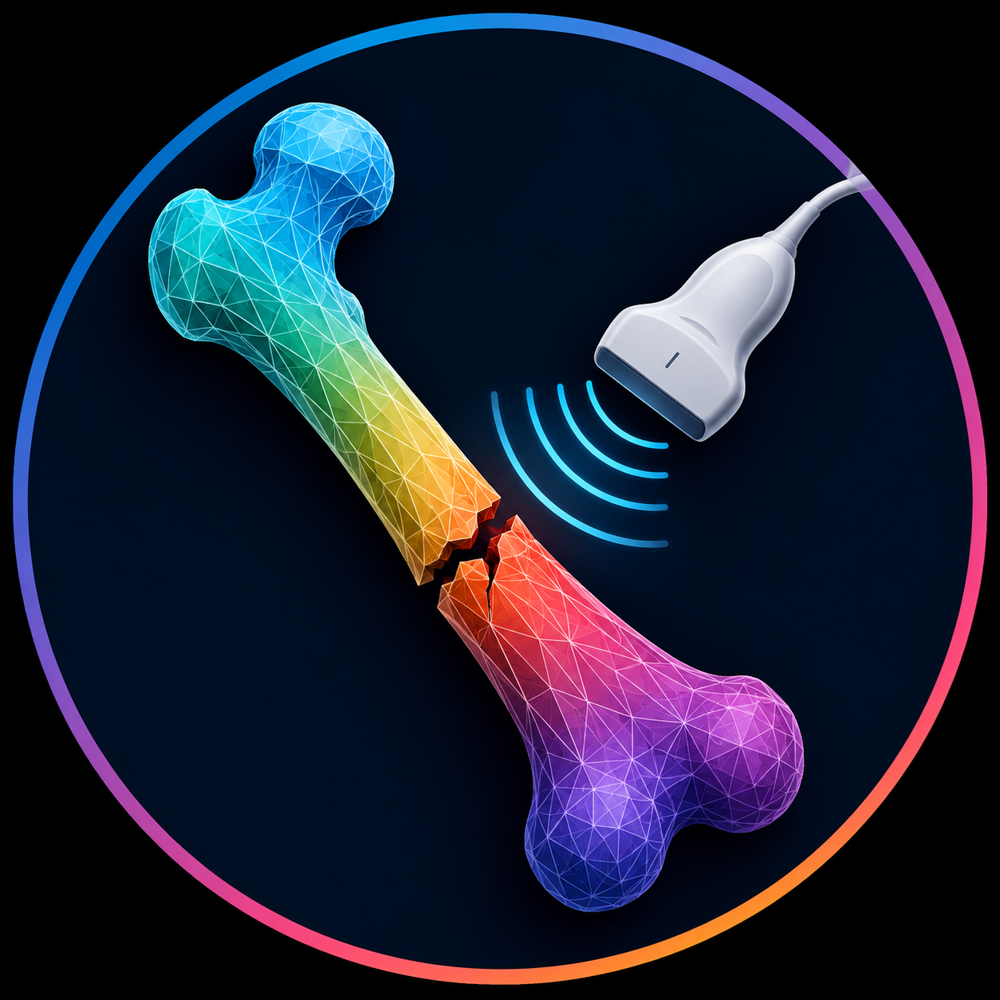
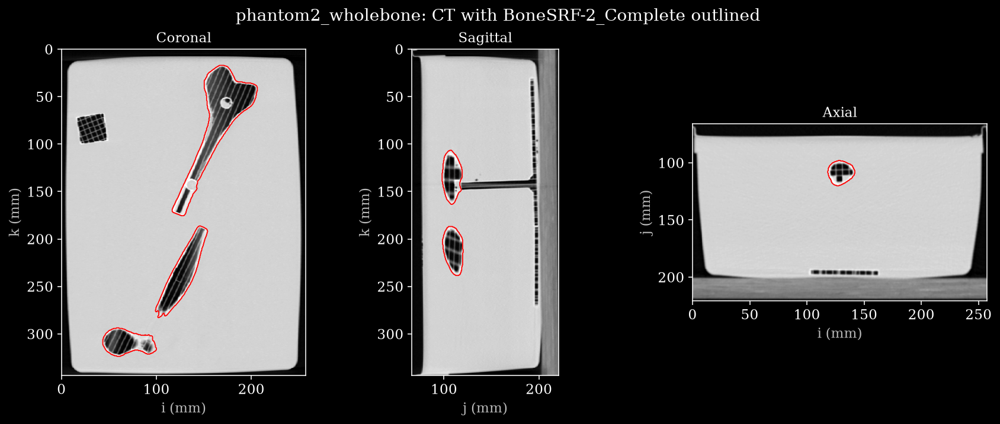

# BoneSRF

<p align="center">
  
</p>

*B-mode of a fractured-femur phantom, frame 45 of [`data/phantom2_wholebone.hdf5`](https://huggingface.co/datasets/nvidia/OpenH-RF/blob/main/strasbourg-basel/BoneSRF/data/phantom2_wholebone.hdf5), beamformed from the recovered channel data.*

## Dataset Description

<p align="center">
  
</p>

**BoneSRF** (Bone Surface Reflection) is an ultrasound channel-data dataset for bone-surface and fracture-reflection research. It contains three 3D-printed, fractured femur phantoms, scanned with a handheld point-of-care probe, inverted back to pre-beamformed RF and packaged in the OpenH-RF `zea` format.

Each phantom was swept three times (`distal`, `proximal`, `wholebone`), giving nine `zea` HDF5 files. Every scan is robot-tracked: the probe was mounted on a robotic arm and its pose recorded separately. Each file also carries that phantom's CT scan and multi-label segmentation.

The channel data here is not a direct per-element sensor recording. A Clarius handheld probe does not expose its raw per-element channel data, only its own internally beamformed RF output. Every `raw_data` array is therefore a numerical estimate: the per-element channel data consistent with the probe's known per-scanline focused acquisition geometry (transmit delays, apodization, walking sub-aperture) that would reproduce the real Clarius output if beamformed the same way. It is recovered by a conjugate-gradient least-squares (CGLS) inversion of a zea `DASOperator` built from that geometry, using the real beamformed phantom scans as the inversion target.

This is phantom data, not simulated, clinical or in-vivo. It is intended for full-matrix-capture-style beamforming and image-reconstruction research at a bone-tissue interface, and as an example of recovering pre-beamformed data from beamformed-only ultrasound exports.

### How the data was generated

1. **Acquisition.** Each phantom was scanned with a Clarius L20HD3 linear array, producing the probe's own beamformed RF output. This is the physically acquired data, not simulated.
2. **Inversion.** The beamformed RF is inverted back into pre-beamformed, per-element channel data with [`das-inverse` (`clarius` branch)](https://github.com/sankethvedula/das-inverse/tree/clarius), a CGLS solver over a `zea.inverse.DASOperator` forward model of the probe's focused, walking-sub-aperture transmit sequence (`invert_clarius_beamformed.py`). The result is not sensor-captured, but numerically consistent with the real beamformed acquisition it was inverted from.
3. **Packaging.** The inverted channel data, transmit-sequence metadata, probe geometry, per-frame probe pose, and the phantom's CT + segmentation are written out as one `zea` HDF5 file per scan, matching the OpenH-RF format spec.

### Probe tracking

The probe was mounted on a robotic arm and its pose recorded separately by a trakSTAR electromagnetic tracking system with a fixed fCal image-to-probe calibration. The pose stream is stored per frame in each file's metadata (`metadata/probe_pose`: translation, rotation, timestamps), so `metadata/probe_pose[i]` corresponds to `raw_data[i]`. The raw tracking capture is not shipped, only the recovered, aligned pose stream.

### The three phantoms

Each phantom is a 3D-printed femur, modeled from a CC BY 4.0–licensed femur bone dataset, with a different simulated fracture pattern. Each printed femur is immersed in ultrasound-coupling gel and scanned by a robotic arm, which gives repeatable probe trajectories rather than a freehand scan. Each phantom is scanned three times, at three positions along the bone:

- **`distal`**: a sweep over the distal region of the femur
- **`proximal`**: a sweep over the proximal region of the femur
- **`wholebone`**: a sweep covering the full length of the femur

## Dataset Contributor(s)

- Sidaty El Hadramy (IHU Strasbourg; Department of Biomedical Engineering, University of Basel)
- Philippe C. Cattin (IHU Strasbourg; Department of Biomedical Engineering, University of Basel)
- Juan Verde (IHU Strasbourg; Department of Biomedical Engineering, University of Basel)

## Dataset Creation Date

Clarius acquisitions: 19/06/2026 (`phantom1_distal`) and 25/06/2026 (`phantom1_proximal`). The other seven sweeps carry no recorded acquisition date, see [Known Issues](#known-issues). Converted to the `zea` format in 2026.

## License / Terms of Use

[Creative Commons Attribution 4.0 International (CC BY 4.0)](https://creativecommons.org/licenses/by/4.0/legalcode.en). Retain attribution and identify modifications when reusing the data.

## Intended Usage

Full-matrix-capture-style beamforming research on recovered (not directly sensed) channel data at a bone-tissue interface: delay-and-sum reconstruction, adaptive and aberration-correction beamforming benchmarks, and robot/EM-tracked probe-pose fusion. It also serves as a reference for recovering pre-beamformed data from other beamformed-only scanners.

## Dataset Characterization

- **Data Collection Method:** phantom (3D-printed, bone-mimicking femur, immersed in ultrasound-coupling gel); scanned with a Clarius handheld-probe-class linear array mounted on and moved by a robotic arm; raw channel data recovered via CGLS inversion of the probe's beamformed RF output (not a direct per-element recording); probe pose independently tracked via a trakSTAR EM tracking system, fCal-calibrated.
- **Labeling Method:** a CT scan of each 3D-printed phantom and a multi-label segmentation of it (authored in 3D Slicer) are stored inside each of that phantom's three files, under `custom/ct/` and `custom/ct_segmentation/`. See [CT reference imaging](#ct-reference-imaging). There are no annotations on the RF data itself.
- **Acquisition system:** Clarius L20HD3, 192-element linear array, 0.130 mm pitch (24.8 mm aperture), 10 MHz center frequency, 30 MHz sampling frequency, 1540 m/s sound speed, ~5.1 cm imaging depth (1984–2016 axial samples depending on scan), single fixed transmit focus at 25.3–25.8 mm (`focus_distances` is constant across all 192 transmits within a scan), 192 focused transmits per frame (one per lateral scanline, no steering), Hanning-windowed walking sub-aperture per scanline with 47 to 97 of 192 elements active per transmit (mean 84, narrowest at the array edges).

The CT and segmentation data inside the files are released under the same CC BY 4.0 terms as the channel data. The femur geometry behind the 3D-printed phantoms comes from a CC BY 4.0–licensed bone model dataset.

## Processing the Dataset

The acquisitions can be processed with the `reconstruct.py` [script](https://github.com/open-h/OpenH-RF/blob/main/datasets/strasbourg-basel/reconstruct.py) as provided in the [OpenH-RF GitHub repository](https://github.com/open-h/OpenH-RF), together with the `pipeline.yaml` definition in this folder and the [zea library](https://github.com/tue-bmd/zea). The script streams the data from the Hugging Face Hub.

The script loads the saved `zea.Pipeline` from `pipeline.yaml`, runs it on one frame of one scan, and writes `assets/<scan>.png`.

The constants at the top of the script select what is reconstructed:

- `SCAN`: the scan to reconstruct, as a local path or an `hf://` URI.
- `FRAME`: the frame to beamform. `None` uses that scan's reference frame, the one its reference image was rendered from.
- `DEVICE`: where to run, e.g. `"cpu"`, `"cuda:0"` or `"auto:1"`.
- `CT`: also plot the CT carried in the file, to `assets/ct_<scan>.png`.

These values reconstruct `phantom2_wholebone` at its reference frame (45) on the CPU:

```python
SCAN = "hf://nvidia/OpenH-RF/strasbourg-basel/BoneSRF/data/phantom2_wholebone.hdf5"
FRAME = None
DEVICE = "cpu"
```

and produce the B-mode image shown at the top of this card.

The pipeline is `cast` → `apply_window` → `beamform` (delay-and-sum with a per-transmit `pfield` weighting, since this is a per-scanline focused walking-sub-aperture acquisition rather than full synthetic aperture) → `keras.ops.abs` → axial-only Gaussian blur → `normalize` → `log_compress`. Display parameters (dynamic range, p-field settings) also come from `pipeline.yaml`; acquisition geometry comes from each file's own `scan` and `probe` groups.

The reconstruction does not use `zea.inverse`. That module is for the CGLS inversion that produced these files, not for reading them back. Runtime is about 30 s per frame on CPU. Each file is a full sweep of 20 to 25 GB, but only the requested frame is read.

## Dataset Format

[zea v0.1.6](https://github.com/tue-bmd/zea)

Submitted in the [`zea` file format](https://zea.readthedocs.io/en/openh-rf-latest/) as nine HDF5 files.

The channel data was recovered from the probe's real, beamformed RF output by CGLS-inverting a `zea.inverse.DASOperator` built from the known acquisition geometry. `t0_delays`, `tx_apodizations`, `focus_distances`, `transmit_origins`, `polar_angles`, and `waveforms_two_way` are copied directly from the values that inversion's DAS operator was built with, not re-derived. The source `.npz` had no explicit `demodulation_frequency`; it was substituted with `center_frequency` per the standard convention for RF (non-IQ) sources.

Probe pose (`metadata/probe_pose`: translation, rotation, timestamps) was recovered from the trakSTAR tracking capture via a fixed fCal image-to-probe calibration, resampled onto each `raw_data` frame's own acquisition time before conversion, and stored per frame, so `metadata/probe_pose[i]` corresponds to `raw_data[i]`.

CT and segmentation were copied verbatim out of the `.nrrd` files that previously shipped alongside the RF data, so that every file is self-contained; the source NRRD headers are preserved with them. Grid geometry is converted from the NRRD's millimetres to zea's SI metres.

Reading these files requires `h5py` built against HDF5 ≥ 2.0 (e.g. `h5py` ≥ 3.16), see [Known Issues](#known-issues).

### Fields

Every file has the same field structure; `n_frames` and `n_ax` vary per scan (see [Dataset Quantification](#dataset-quantification)).

| Field | Shape | dtype | Units | Description |
|---|---|---|---|---|
| `raw_data` | `(n_frames, 192, n_ax, 192, 1)` | float32 | a.u. | RF channel data: frame × transmit × axial sample × element × channel |
| `scan.sampling_frequency` | scalar | float32 | Hz | 30 MHz |
| `scan.center_frequency` | scalar | float32 | Hz | 10 MHz (`demodulation_frequency` is identical) |
| `scan.sound_speed` | scalar | float32 | m/s | 1540 |
| `scan.t0_delays` | `(192, 192)` | float32 | s | Per-element transmit delay per transmit (focused walking sub-aperture) |
| `scan.tx_apodizations` | `(192, 192)` | float32 | — | Hanning-windowed walking sub-aperture (47–97 elements active per transmit) |
| `scan.focus_distances` | `(192,)` | float32 | m | Constant within a scan (single fixed focus) |
| `scan.polar_angles` | `(192,)` | float32 | rad | Constant, 0.0 (no steering; purely translated scanlines) |
| `scan.transmit_origins` | `(192, 3)` | float32 | m | Per-transmit origin along the array |
| `scan.waveforms_two_way` | `(192, 303)` | float32 | a.u. | Two-way pulse waveform per transmit |
| `scan.initial_times` | `(192,)` | float32 | s | Per-transmit acquisition start time |
| `scan.time_to_next_transmit` | `(n_frames, 192)` | float32 | s | Inter-transmit interval |
| `probe.probe_geometry` | `(192, 3)` | float32 | m | Element positions (linear array, y = z = 0); confirms 0.130 mm pitch / 24.8 mm aperture |
| `metadata.probe_pose.translation` | `(n_frames, 3)` | float32 | m | Tracked probe position, one entry per `raw_data` frame (index-aligned) |
| `metadata.probe_pose.rotation` | `(n_frames, 4)` | float32 | — | Quaternion (xyzw), tracked probe orientation, index-aligned with `raw_data` |
| `metadata.probe_pose.timestamps` | `(n_frames,)` | float32 | s | Pose time, relative to the first frame |
| `custom.ct.volume` | `(n_k, n_j, n_i)` | int16 | a.u. | CT volume, `(k, j, i)`; nominally Hounsfield units (source header records no unit) |
| `custom.ct.affine` | `(4, 4)` | float64 | m | Voxel index `(i, j, k, 1)` → LPS position in metres |
| `custom.ct_segmentation.labelmap` | `(n_k, n_j, n_i, 2)` | uint8 | — | Layered 3D Slicer labelmap on the CT grid; mask = `labelmap[..., layer] == label_value` |
| `custom.ct_segmentation.segment_names` | `(3,)` | str | — | Segment names |
| `custom.ct_segmentation.segment_label_values` | `(3,)` | uint8 | — | Label value of each segment within its own layer |
| `custom.ct_segmentation.segment_layers` | `(3,)` | uint8 | — | Index into the last axis of `labelmap` holding each segment |

## Folder structure

```
BoneSRF/
├── README.md              ← this file (dataset overview + data card for all nine scans)
├── LICENCE                (CC BY 4.0)
├── pipeline.yaml          (saved zea.Pipeline, shared by all nine scans)
├── reconstruct.py         (runs pipeline.yaml on any scan, and plots its CT)
├── assets/
│   ├── reference_bmode.png       (the B-mode shown below)
│   └── ct_<scan>.png             (CT slices of the scan's phantom)
├── data/
│   ├── phantom1_distal.hdf5      (zea channel data + per-frame probe pose + CT)
│   ├── phantom1_proximal.hdf5
│   ├── phantom1_wholebone.hdf5
│   ├── phantom2_*.hdf5           (same three sweeps)
│   └── phantom3_*.hdf5           (same three sweeps)
└── reference_bmodes/
    └── <scan>.png                (one reference reconstruction per scan)
```

Every file in `data/` is self-contained: it holds the CGLS-recovered pre-beamformed channel data, the transmit-sequence and probe metadata needed to beamform it, the per-frame probe pose, and the CT and segmentation of the phantom it shows.

## CT reference imaging

Each phantom's CT scan and its multi-label 3D Slicer segmentation are stored inside all three of that phantom's `zea` files, under `custom/ct/` and `custom/ct_segmentation/`. They are not shipped as separate `.nrrd` sidecars, so no file depends on another.

<p align="center">
  
</p>

Three slices of phantom2's CT, written by `reconstruct.py` with `CT = True`, with the `BoneSRF-2_Complete` segment outlined in red. The printed femur is hollow, so it reads dark against the bright coupling gel, and the coronal view shows the fracture: the bone is in separate, displaced pieces.

| Dataset | Contents |
|---|---|
| `custom/ct/volume` | CT volume, `int16`, stored `(k, j, i)` (slice, row, column) |
| `custom/ct/spacing`, `origin`, `direction`, `affine` | Grid geometry in SI metres; `affine` maps voxel index `(i, j, k, 1)` to an LPS position |
| `custom/ct/nrrd_header` | Verbatim header of the source NRRD (distances in millimetres) |
| `custom/ct_segmentation/labelmap` | Layered binary labelmap on the same grid, `uint8` |
| `custom/ct_segmentation/segment_*` | Per-segment name, label value, layer, colour, bounding box and 3D Slicer ID |

Grid geometry differs per phantom:

| Phantom | CT grid | Stored array | Source spacing (mm) |
|---|---|---|---|
| phantom1 | `512 × 512 × 594` | `(594, 512, 512)` | `0.546875 × 0.546875 × 0.6` |
| phantom2 | `512 × 512 × 574` | `(574, 512, 512)` | `0.50390625 × 0.50390625 × 0.6` |
| phantom3 | `512 × 512 × 594` | `(594, 512, 512)` | `0.5625 × 0.5625 × 0.6` |

Each segmentation has three segments, one per RF sweep of that phantom. Label values repeat across layers, because 3D Slicer keeps segments on separate internal labelmap layers, so read a segment's mask as `labelmap[..., segment_layers[s]] == segment_label_values[s]` rather than treating the array as one flat labelmap:

| Segment | `segment_label_values` | `segment_layers` | Corresponds to |
|---|---|---|---|
| `BoneSRF-1_Proximal` | 1 | 0 | `phantom1_proximal` |
| `BoneSRF-1_Distal` | 2 | 0 | `phantom1_distal` |
| `BoneSRF-1_Complete` | 1 | 1 | `phantom1_wholebone` |
| `BoneSRF-2_Complete` | 1 | 0 | `phantom2_wholebone` |
| `BoneSRF-2_Distal` | 1 | 1 | `phantom2_distal` |
| `BoneSRF-2_Proximal` | 2 | 1 | `phantom2_proximal` |
| `BoneSRF-3_Proximal` | 2 | 0 | `phantom3_proximal` |
| `BoneSRF-3_Distal` | 3 | 0 | `phantom3_distal` |
| `BoneSRF-3_Complete` | 1 | 1 | `phantom3_wholebone` |

The CT is reference imaging of the physical phantom in scanner (LPS) space. It is not spatially registered to the RF frames or to the tracked probe poses; no CT-to-ultrasound registration is provided.

## Dataset Quantification

**Current OpenH-RF release:** 9 HDF5 files; 200.75 GB (200,745,025,536 bytes) stored; root `zea_version` **0.1.6**. Sizes include all HDF5 contents and use decimal units (MB = 10^6 bytes, GB = 10^9 bytes, TB = 10^12 bytes), not decoded-array memory or original-source download sizes.

Nine acquisitions, one continuous sweep each; 1,427 frames in total. No train / val / test split (each file is a single reference acquisition). Every scan has one tracked probe pose per frame.

| Scan | Frames | `n_ax` | Focus | Reference frame | Size on disk |
|---|---|---|---|---|---|
| `phantom1_distal` | 144 | 2016 | 25.70 mm | 130 | 20.53 GB |
| `phantom1_proximal` | 174 | 2000 | 25.55 mm | 100 | 24.49 GB |
| `phantom1_wholebone` | 158 | 1984 | 25.30 mm | 150 | 21.93 GB |
| `phantom2_distal` | 162 | 2000 | 25.65 mm | 40 | 22.80 GB |
| `phantom2_proximal` | 142 | 2016 | 25.75 mm | 40 | 20.24 GB |
| `phantom2_wholebone` | 155 | 2016 | 25.80 mm | 45 | 21.95 GB |
| `phantom3_distal` | 166 | 1984 | 25.30 mm | 100 | 23.04 GB |
| `phantom3_proximal` | 167 | 2016 | 25.80 mm | 0 | 23.67 GB |
| `phantom3_wholebone` | 159 | 1984 | 25.35 mm | 100 | 22.08 GB |

## Subject Metadata

3D-printed, bone-mimicking musculoskeletal phantoms (bone surface reflection targets); no human or animal subject. Scanned with a robot-mounted Clarius L20HD3 linear array at 10 MHz / ~5.1 cm depth / single transmit focus.

## Data Validation

All nine files pass the `zea` data spec, both `File.validate()` (structural) and `File.validate_spec()` (dtype, shape and dimension consistency). `reconstruct.py` runs end-to-end on every scan; the images in `reference_bmodes/` are its output.

## Known Issues
- **Fracture patterns are not documented per phantom.** The location, type (transverse / oblique / comminuted / hairline) and displacement of each phantom's fracture are not recorded. The CT segmentation in each file is ground truth for the physical phantom geometry.
- **Acquisition dates are incomplete.** Only `phantom1_distal` (19/06/2026) and `phantom1_proximal` (25/06/2026) have a recorded original Clarius acquisition date; the other seven sweeps do not carry one in the file or in the source capture.
- **No CT-to-ultrasound registration.** The CT is in scanner LPS space and the probe poses in trakSTAR tracker space. Nothing here relates the two.
- **CT intensity units are unverified.** The source NRRD headers record no unit. The value range (−1024 to about 500) is consistent with Hounsfield units, but this has not been confirmed.

## Ethical Considerations

3D-printed phantom data; no human or animal subjects; no PHI.
