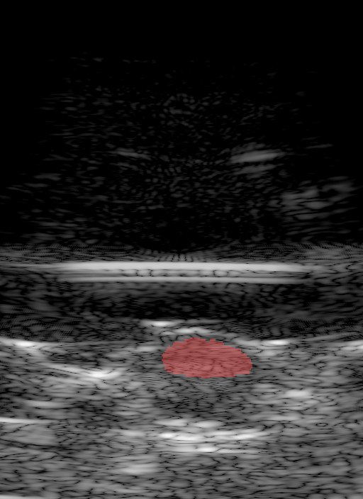

# Ilovitsh Lab Mice Tumors & Water-Bead Phantoms

*Cine loop of the rotational sweep through a mouse tumor, [`mouse_tumor/seg/01-scan-3.hdf5`](https://huggingface.co/datasets/nvidia/OpenH-RF/blob/main/tel-aviv/mouse_tumor/seg/01-scan-3.hdf5), reconstructed from the raw channel data with `mouse_tumor/pipeline.yaml`.*

## Dataset Description

This dataset provides ultrasound data captured via a motorized 1D transducer array. It captures both in-vivo tumors in mice and in-silico water-bead phantoms, and was originally acquired as part of our work on implicit neural representations (INR) [1]. The primary task for this released dataset is the segmentation of tumors (in mice) and water beads (in phantoms) from multi-angle ultrasound acquisitions.

Data was acquired using a motorized 1D array transducer with 128 elements (IP104, Sonic Concepts) operated by a Vantage 256 system (Verasonics Inc.). For the in-vivo data, 5 breast cancer tumor-bearing mice were scanned under anesthesia. Each volume was sampled across a 180° rotation at 1.25° intervals, yielding 144 angular frames per acquisition. At each angle, five plane waves were steered linearly between -5° and 5°.

Each beamformed B-mode image was semi-manually annotated by a non-professional using MedSAM [2]. Volumetric comparison of these segmentation masks against manual measurements produced a mean volumetric error of 6.8% ± 1.5%.

## Dataset Contributor(s)

- Tal Grutman (Ilovitsh Lab, Tel Aviv University)
- Tali Ilovitsh (Ilovitsh Lab, Tel Aviv University)

## Dataset Creation Date

16/06/2026

## License / Terms of Use

[Creative Commons Attribution 4.0 International (CC BY 4.0)](https://creativecommons.org/licenses/by/4.0/legalcode.en). Retain attribution and identify modifications when reusing the data.

## Intended Usage

Segmentation of tumors in mice and water-bead phantoms.

## Dataset Characterization

- **Data collection method:** Phantom (agarose with water beads) and Animal (in-vivo mice).
- **Labeling method:** Semi-automatic, labelled with MedSAM [2].
- **Acquisition system:** 128-element phased array (IP104, Sonic Concepts) with a 0.22 mm pitch, 13.5 mm elevation aperture, and center frequency of 3.5 MHz. Controlled by Vantage 256 (Verasonics Inc.) and a motorized rotary (RTY-IP100). Sampling rate 14 MHz.

## Processing the Dataset

The acquisitions can be processed with the `reconstruct.py` [script](https://github.com/open-h/OpenH-RF/blob/main/datasets/tel-aviv/reconstruct.py) as provided in the [OpenH-RF GitHub repository](https://github.com/open-h/OpenH-RF), together with the `pipeline.yaml` definitions in `mouse_tumor/` and `phantom/` and the [zea library](https://github.com/tue-bmd/zea). The script streams the data from the Hugging Face Hub and overlays the stored segmentation on the reconstructed B-mode.

## Dataset Format

[zea v0.1.6](https://github.com/tue-bmd/zea)

## Dataset Quantification

**Current OpenH-RF release:** 22 HDF5 files; 4.36 GB (4,357,947,392 bytes) stored; root `zea_version` **0.1.6**. Sizes include all HDF5 contents and use decimal units (MB = 10^6 bytes, GB = 10^9 bytes, TB = 10^12 bytes), not decoded-array memory or original-source download sizes.

- **Samples / frames:** 22 total `.hdf5` acquisitions. Each acquisition contains 144 angular frames covering a 180° rotation (1.25° increments) of 5 plane waves.
- **Train / val / test split:** N/A
- **Stored HDF5 size:** 4.36 GB (4,357,947,392 bytes).

| Field | Shape | dtype | Units | Description |
|---|---|---|---|---|
| `raw_data` | `(144, 5, N_ax, 128, 1)` | float32 | — | Raw RF channel data |
| `segmentation.values` | `(144, H, W, N_classes)` | bool | — | One-hot segmentation mask (if applicable) |

## Subject Metadata

5 tumor-bearing female FVB/NHanHsd mice (injected with Met-1 mouse breast carcinoma cells). 2 phantoms containing 3 water gel beads in an agarose mixture.

| Subject / Phantom | Imaging Depth (cm) |
|---|---|
| phantom_01 | 4.7 |
| phantom_02 | 4.7 |
| subject_01 | 7.7 |
| subject_02 | 7.7 |
| subject_03 | 7.2 |
| subject_04 | 7.2 |
| subject_05 | 7.2 |

## Known Issues

3D position data is not provided.

## Ethical Considerations

Animal-related procedures were conducted in accordance with the guidelines provided by the Institutional Animal Research Ethical Committee.

The data has been cleared for release under CC BY 4.0 (institutional review approval TAU-MD-IL-2407-154–5).

## References
[1] Grutman et al., “Implicit neural representation for scalable 3D reconstruction from sparse ultrasound images,” npj. Acoust., 2025. https://doi.org/10.1038/s44384-025-00018-5 [2] Ma et al., “Segment anything in medical images,” Nat. Commun., 2024. https://www.nature.com/articles/s41467-024-44824-z
