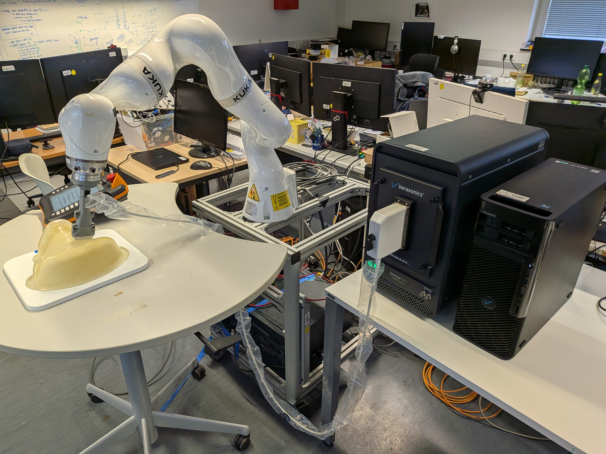
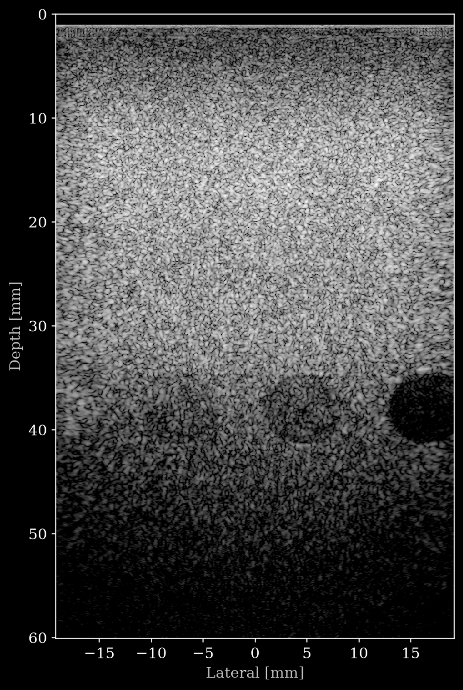
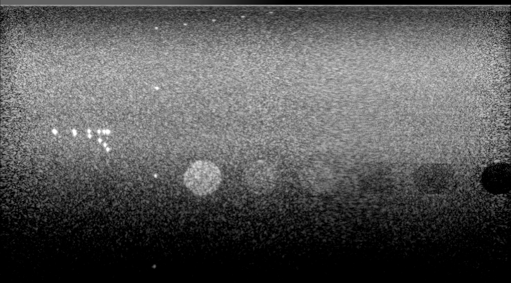

# Robotic Tracked Ultrasound — Verasonics L11-5gH, vascular arm, CIRS 054GS and CIRS 074 thyroid phantoms

<table><tr>
    <td width="30%"></td>
    <td width="20%"></td>
    <td width="60%"></td>
  </tr>
  <tr>
    <td align="center">Acquisition setup</td>
    <td align="center">Reconstruction</td>
    <td align="center">Panoramic reconstruction (based on robotic tracking)</td>
  </tr>
</table>

*Acquisition setup (left), a single-frame reconstruction (middle) and a panoramic reconstruction compounded along the robot-tracked sweep (right) of the CIRS 054GS phantom, [`data/cirs_phantom/synth_apert_sweep_1.hdf5`](https://huggingface.co/datasets/nvidia/OpenH-RF/blob/main/tumunich/data/cirs_phantom/synth_apert_sweep_1.hdf5).*

## Dataset Description

Robotically tracked freehand ultrasound of three tissue-mimicking phantoms, acquired with a Verasonics Vantage NXT 64 and an L11-5gH linear probe held by a KUKA LBR robot:

- a **Blue Phantom Gen II PICC, PIV and Arterial Line Vascular Access training model (BPA304-HP)** — an upper-extremity arm phantom with a nine-vessel system (cephalic, basilic, medial cubital, radial and ulnar veins plus brachial, radial and ulnar arteries) in self-healing tissue-mimicking material;
- a **CIRS Model 054GS** General Purpose Ultrasound Phantom;
- a **CIRS Model 074** Thyroid Ultrasound Training Phantom — a slightly enlarged thyroid gland in an anthropomorphic neck of Zerdine® hydrogel, with the trachea, common carotid artery and internal jugular vein as internal landmarks and one cyst plus one isoechoic stiff lesion per lobe.

Each frame is a multi-angle plane-wave acquisition of raw pre-beamformed channel data, and every frame carries the measured robot end-effector pose, so the sweeps can be compounded into 3D. **Multiple tracked sweeps were recorded from each phantom**: the sweeps belonging to one scan area are concatenated into a single track within that file (multi-angle acquisition, except the synth aperture dataset). The phantom was not moved between the scans: they are overlapping and tracking information is calibrated with respect to each other. For the multi-angle data, individual sweeps are always recorded between two defined poses with varying out-of-plane rotation (around the x-axis). The first sweep refers to -15 degree, with every following sweep raising that angle by 5 degree until it reaches 15 degree (in total 7 scans). For the two transverse scans in the CIRS phantom, we only recorded -15 to +10 degree, due to the limited scan area of the robot. For the two transverse scans in the thyroid phantom, we only recorded -10 to +10 degree, due to the limited scan area of the robot. `custom/sweep_index` identifies the originating sweep per frame. This is **phantom** data (no human or animal subjects). The intended contribution is a raw-channel-data benchmark for tracked freehand reconstruction and beamforming.

## Dataset Contributor(s)

- Felix Dülmer <felix.duelmer@tum.de> (primary contact)
- Mohammad Farid Azampour <mf.azampour@tum.de>
- Rüdiger Göbl <goebl@imfusion.com>
- Oliver Zettinig <zettinig@imfusion.com>
- Nassir Navab <nassir.navab@tum.de>
- CAMP (Computer Aided Medical Procedures), Technical University of Munich (TUM)

## Dataset Creation Date

07/16/2026

## License / Terms of Use

[Creative Commons Attribution 4.0 International (CC BY 4.0)](https://creativecommons.org/licenses/by/4.0/legalcode.en). Retain attribution and identify modifications when reusing the data.

## Intended Usage

Primary task: **robotic tracked ultrasound acquisition** — compounding the per-frame robot poses with the tracked sweeps for freehand 3D reconstruction. The raw channel data also supports advanced beamforming research.

## Dataset Characterization

- **Data Collection Method:** phantom
- **Labeling Method:** per-file annotations of anatomy and imaging plane in `metadata/annotations`, constant within a file and broadcast over its frames; no per-frame labels. A co-registered robot pose stream is provided per frame.
- **Acquisition system:** Verasonics Vantage NXT 64; L11-5gH linear array, 128 elements, 0.30 mm pitch, 7.6 MHz center frequency, 76.8% fractional bandwidth; 30.3 MHz receive sampling; 1540 m/s assumed sound speed. Transmit: 7 plane-wave angles (−18° … +18° in 6° steps), each acquired with three walking 64-element mux sub-apertures (21 acquisitions per frame). Imaging depth: 50 mm for the arm phantom and 60 mm for the CIRS phantom.

## Processing the Dataset

The acquisitions can be processed with the `reconstruct.py` [script](https://github.com/open-h/OpenH-RF/blob/main/datasets/tumunich/reconstruct.py) as provided in the [OpenH-RF GitHub repository](https://github.com/open-h/OpenH-RF), together with the `pipeline.yaml` definition in this folder and the [zea library](https://github.com/tue-bmd/zea). The script streams the data from the Hugging Face Hub.

`reconstruct.py` beamforms a single frame and compares it to the stored Verasonics B-mode; [`reconstruct_panorama.py`](https://github.com/open-h/OpenH-RF/blob/main/datasets/tumunich/reconstruct_panorama.py), with `pipeline_panorama.yaml`, compounds a tracked sweep into the panoramic reconstruction shown above, using the per-frame robot poses.

## Dataset Format

[zea v0.1.4](https://github.com/tue-bmd/zea)

*zea* HDF5. The recorded Verasonics `.vrs` files are read natively in Python (no MATLAB): the multiplexed 64-channel receive apertures are expanded to the full 128-element probe dimension, and the per-transmit hardware time tags embedded in the channel data are decoded to build `time_to_next_transmit`. The transmit-time-gain-compensation (TGC) applied on the Verasonics hardware is left in the raw data; no additional filtering, decimation, or demodulation is applied before packaging.

The `image` accompanying each frame is **not** our reconstruction: it is the B-mode produced by the **Verasonics vendor pipeline** and displayed live by VSX during acquisition, saved from the display. That pipeline coherently compounds the IQ of all 21 receive events (7 plane-wave angles × 3 walking 64-element mux sub-apertures) onto the display grid, then applies envelope detection, power compression, a reject floor and simple temporal persistence before mapping to 8-bit grayscale. Two consequences matter for use: the persistence means **consecutive frames are not fully independent**, and the compression is not calibrated, so the image is a **qualitative reference only** — reconstruct from `raw_data` for anything quantitative. The same note is stored in the files themselves, as the `description` of `tracks/track_0/data/image`.

Zero-valued rows pad the top of each stored frame so the image starts at the transducer face rather than at the imaging start depth, which matters when compounding the tracked sweeps into 3D. `tracks/track_0/data/image/coordinates` already accounts for the padding, so the exact offset can be read back per file rather than assumed.

## Dataset Quantification

**Current OpenH-RF release:** 11 HDF5 files; 62.25 GB (62,245,175,296 bytes) stored; root `zea_version` **0.1.4**. Sizes include all HDF5 contents and use decimal units (MB = 10^6 bytes, GB = 10^9 bytes, TB = 10^12 bytes), not decoded-array memory or original-source download sizes.

- **Phantoms:** 3 (vascular access arm phantom, CIRS 054GS, CIRS 074 thyroid)
- **Files:** 11 zea HDF5 files across 3 sub-dataset folders
- **Sweeps:** multiple tracked sweeps per phantom, concatenated per file
- **Frames / acquisitions:** 17,852 frames in total; ~200–425 frames per sweep (i.e. for one file with 7 sweeps, ~2100 frames)
- **Stored HDF5 size:** 62.25 GB (62,245,175,296 bytes).
- **Train / val / test split:** N/A

| Folder | Files | Frames | Sweeps per file |
|---|---|---|---|
| `arm_phantom/` | 2 | 5,018 | 7 |
| `cirs_phantom/` | 5 | 6,204 | 7 (longitudinal), 6 (transverse), 1 (synth. aperture) |
| `thyroid_phantom/` | 4 | 6,630 | 7 (longitudinal), 5 (transverse) |

The shapes below are for the CIRS 054GS file. The thyroid phantom files have identical per-frame shapes and imaging geometry (60 mm depth, 2816 axial samples). **The arm phantom files were acquired at 50 mm depth and so have 2560 axial samples** — their `raw_data` is `(#frames, 21, 2560, 128, 1)`. Otherwise the layout is the same across all three, differing only in the leading frame count and the number of sweeps.

| Field | Shape | dtype | Units | Description |
|---|---|---|---|---|
| `tracks/track_0/data/raw_data` | `(#frames, 21, 2816, 128, 1)` | int16 | ADC counts | Raw RF channel data (frames, transmits, axial samples, elements, 1) |
| `tracks/track_0/data/image` | `(#frames, 593, 379)` | uint8 | 8-bit intensity | Vendor B-mode from the Verasonics VSX display, not our reconstruction. Qualitative reference only; see Dataset Format |
| `tracks/track_0/scan/*` | — | float32 | SI | Acquisition geometry/timing: `t0_delays`, `tx_apodizations`, `polar_angles`, `initial_times`, `time_to_next_transmit`, `sound_speed`, `center_frequency`, `sampling_frequency`, `tgc_gain_curve`, waveforms |
| `probe/*` | — | float32 | SI | L11-5gH `probe_geometry` (128, 3), `element_width`, `probe_bandwidth_percent`, `lens_thickness`, `lens_sound_speed` |
| `metadata/probe_pose/translation` | `(N, 3)` | float32 | m | Robot end-effector translation stream (~50 Hz) |
| `metadata/probe_pose/rotation` | `(N, 4)` | float32 | quaternion xyzw | Robot end-effector orientation stream |
| `metadata/annotations/anatomy` | `()` | str | — | Anatomy imaged: `thyroid`, `forearm` or `upper_arm`. Absent for the 054GS, which has none |
| `metadata/annotations/view` | `()` | str | — | Imaging plane: `longitudinal` or `transverse`. Absent for the arm phantom, swept along the limb |
| `custom/sweep_index` | `(#frames,)` | int32 | — | Which of the  sweeps each frame belongs to  |

The probe pose is an independently sampled stream; `probe_pose.start_time_offset` and `time_to_next_transmit` place it on the same clock as the frames so the pose can be interpolated at each frame's acquisition time.

`sweep_index` is the one quantity that has no home in the zea schema, so it is stored as a zea custom element (written via `File.create(custom=[...])`, read back as `f.custom.sweep_index`).

### Acoustic lens

`probe/lens_thickness` is the Verasonics `Trans.lensCorrection` one-way lens path (0.6 mm; this probe is defined with `Trans.units = 'mm'`). `probe/lens_sound_speed` is **not** reported by Verasonics and is set to a nominal 1000 m/s for the silicone lens — override it with `convert.py --lens-sound-speed`. Storing the lens physically means the reconstruction only sets `apply_lens_correction: true` and zea applies its refraction model itself, rather than the reconstruction patching `initial_times` by hand.

## Subject Metadata

- **Subjects:** 3 tissue-mimicking phantoms (no human/animal subjects).
- **Phantom models:**
  - Blue Phantom Gen II PICC, PIV and Arterial Line Vascular Access training model (BPA304-HP) — upper-extremity arm phantom, nine-vessel system, self-healing tissue-mimicking material.
  - CIRS Model 054GS (General Purpose Ultrasound Phantom).
  - CIRS Model 074 (Thyroid Ultrasound Training Phantom) — thyroid gland in an anthropomorphic neck, Zerdine® hydrogel, trachea/carotid/jugular landmarks, one cyst and one isoechoic stiff lesion per lobe.
- **Sweeps:** multiple tracked freehand sweeps per phantom.
- **Probe model:** Verasonics L11-5gH.

## Data Validation

`reconstruct.py` runs a `zea.Pipeline` that beamforms a frame from the raw channel data and compares it to the stored Verasonics B-mode. The chain is: cast → band-pass (transducer band) → demodulate → delay-and-sum compounding over all 21 transmits → envelope detect → normalize → power compression.

Both the operation chain and the reconstruction parameters are written to `pipeline.yaml`: the `parameters:` key holds `f_number` (the Verasonics senscutoff aperture, 1.155), the grid limits, and `apply_lens_correction: true`. Everything else — probe geometry, sound speed, the lens — is read from the file by `File.load_parameters()`, so the whole recipe is reproducible from the HDF5 plus that one YAML. Each run rewrites `pipeline.yaml` from the sample it was given and then loads it back to do the reconstruction, so the shipped recipe is always the one that produced the image. The operation chain is the same for all three phantoms; only the data-derived grid limits differ, which is why one `pipeline.yaml` covers the whole submission.

Reference reconstructions are stored next to the sample they came from as `data/<phantom>/<sample>_reconstructed.png`.

## Known Issues

- N/A

## Ethical Considerations

Phantom data only — no human or animal subjects, no PHI, and no IRB/consent required. No de-identification is applicable.

The data is phantom-derived and carries no patient consent or IP encumbrances, so it is cleared for CC BY 4.0.
