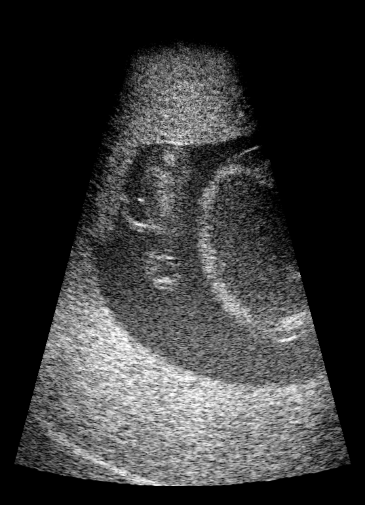

# UBC Module C

## Dataset Description

This dataset contains **3,845 two-dimensional ultrasound frames from two
sessions** with the Kyoto Kagaku Fetus Ultrasound Examination Phantom
“SPACE FAN-ST.” Each frame contains **synthetic RF channel data**, preserved
beamformed IQ, a source-derived B-mode reference, and relative-time links to
NDI tracking, BK scanner viewport video, and Intel RealSense video.

The RF channels were simulated from already beamformed and compounded BK3500
IQ using a custom scatterer model and assumed transmit/receive geometry. They
are not measured pre-beamforming channels. Modalities have temporal
synchronization only; no validated spatial registration is supplied.

## Dataset Contributors

- **Organization:** The University of British Columbia (UBC), Department of
  Electrical and Computer Engineering and School of Biomedical Engineering.
- **Dataset-preparation contact:** Zongze Li, zongze@student.ubc.ca.
- **Contributors:** Zongze Li, Yu Chung Lee, Qi Zeng, Wanwen Chen, Zijian Wu,
  Yuxin Chen, Patrick Boyan Chen, Michael Frew, Tajwar Abrar Aleef, Hamid Moradi, Mohammad Honarvar, Septimiu E. Salcudean, Robert Rohling.

## Dataset Creation Date

- **Physical phantom acquisition:** 06/12/2026.
- **Release preparation:** 09/08/2026.

## License / Terms of Use

The dataset is licensed under **Creative Commons Attribution 4.0 International
(CC BY 4.0)** (https://creativecommons.org/licenses/by/4.0/). The HDF5 `metadata/credit` field carries
the following attribution with the contributor names and contact listed above:

> University of British Columbia OpenH-RF contributors (2026). *UBC Module C:
> Synthetic Channel Proxy and Multimodal Fetal Phantom Ultrasound*. OpenH-RF.
> CC BY 4.0.

## Intended Usage

Research uses include synthetic RF-to-B-mode reconstruction, denoising,
super-resolution, fetal-phantom scan-plane assessment, and temporally aligned
multimodal learning. The dataset is for research and technical evaluation,
not clinical diagnosis. Source-derived reference images are not independent
physical ground truth for the simulated channels.

## Dataset Characterization

- **Collection:** Phantom ultrasound and simultaneous room-camera and tracking
  recordings, followed by deterministic synthetic-channel generation.
- **Acquisition system:** BK3500 ultrasound; NDI Tool-2 tracked-marker poses;
  NDI Tool-1 reference-tool poses; Intel RealSense RGB, left/right infrared,
  and encoded depth video.
- **Labels:** Source indices, synchronization validity flags, and simulation
  provenance. No manual fetal-structure segmentations or verified phantom
  configuration labels are supplied.
- **Simulation framework:** Custom NumPy/SciPy scatterer forward model using
  four-point fractional delays, pulse filtering, frame-specific noise, and
  `int16` quantization. Session 1 preserves its original amplitudes and shared random draws,
  with scatterer depths evaluated on each frame's source IQ axial grid. Session 2 uses fixed
  deterministic positions and reflectivity draws for the session, with
  frame amplitudes derived from its IQ envelope.
  No two-channel proxy data are included as equivalent RF measurements.

### Ultrasound and synthetic-channel parameters

| Parameter | Value | Status |
|---|---:|---|
| Frames | 3,845 | Two sessions; one per matched BK/RealSense frame |
| Focused transmit events per frame | 248 | Stored in each zea file |
| Receive elements | 192 | Synthetic assumption |
| Axial RF samples per trace | 3,153 | Includes 300 zero-tail samples |
| RF components | 1 real component | Stored as `int16` |
| Sampling frequency | 15 MHz | Stored zea scan parameter |
| Center/demodulation frequency | 3.75 MHz | Stored zea scan parameter |
| Assumed sound speed | 1,540 m/s | Stored zea scan parameter |
| Assumed element pitch | 0.2 mm | Synthetic geometry assumption |
| Assumed nominal aperture | 38.4 mm | 192 elements × 0.2 mm |
| Element width / height | 0.18 mm / 5.0 mm | Synthetic model |
| Assumed transmit focus | 98 mm | Copied from source scan metadata |
| RF trace duration | 210.2 µs | Stored raw-data attribute |
| Zero-amplitude tail | 20 µs / 300 samples | Stored raw-data attributes |
| Target maximum magnitude | 26,000 counts | Below `int16` full scale |

The element geometry and dimensions are simulation assumptions, not measured
probe specifications. The relationship between the recorded 98-mm focus and
the proprietary scanner transmit law is unknown.

## Dataset Format

Each zea HDF5 file contains one frame and is written with **zea 0.1.5**.
The writer-version field describes serialization,
not processing speed. Source IQ and its display reference are under
`/custom/source_provenance`.

### Package layout

| Path | Contents |
|---|---|
| `acquisitions/session_01/session_01_fNNNN.hdf5` | Selected source frames 0055–2586; gaps are intentional |
| `acquisitions/session_02/session_02_fNNNN.hdf5` | Selected source frames 0001–5017; gaps are intentional |
| `source_bmode/session_XX/` | BK viewport MP4 video |
| `external_camera/session_XX/` | RealSense MP4 video |
| [`pipeline.yaml`](pipeline.yaml) | Shared reconstruction configuration for both sessions |

`session_XX` denotes `session_01` or `session_02`. All public identifiers are
neutral session labels. HDF5 `source_file` values identify private source
container aliases, not downloadable package files; the source IQ is embedded
in each sample. This HF release includes HDF5 files, this card, the pipeline
configuration, and the source BK viewport and RealSense MP4 videos.
Composite review videos, standalone scripts, timing/tracking tables,
calibration sidecars, and validation reports are not included. References
inside unchanged HDF5 metadata may identify sidecars from the source package
that are not available in this release.

### Timestamp conventions

**All acquisition timestamps are session-relative. Absolute wall-clock times
are intentionally withheld for de-identification.** IQ, BK viewport, NDI
reference-tool, and RealSense host times are relative to the first **source** IQ
frame of their own session, even when that frame is excluded from the release. RealSense device time is relative to its first camera frame.
Negative host-relative camera times can precede the first IQ frame.
Each one-frame zea probe-pose timestamp is locally zero, with session-relative
IQ time stored separately in `/custom/synchronization`.

Use alignment indices and validity flags, not video frame rate alone, to link
modalities. The HDF5 Tool-2 previous/next/recorded-last indices address the
**status-zero subset** of the source tracking records. Tool-1 reference
indices address the full source reference-tool records. These standalone
tables are not included in this HF release. MP4 playback time is an encoded
presentation timeline, not an acquisition clock; use the per-frame
synchronization metadata retained in HDF5.

## Dataset Quantification

| Quantity | session_01 | session_02 | Total |
|---|---:|---:|---:|
| Retained ultrasound frames / HDF5 files | 1,339 | 2,506 | 3,845 |
| Original ultrasound frames | 2,613 | 5,019 | 7,632 |
| Excluded unmatched or repeated video associations | 1,274 | 2,513 | 3,787 |
| Retained source frame range (with gaps) | 55–2586 | 1–5017 | Original frame numbers preserved |
| Retained IQ time span (s) | 1.063–52.681 | 0.018–93.757 | Separate source-session origins |
| BK viewport video frames | 1,582 | 2,798 | 4,380 |
| Frames per RealSense stream | 1,591 | 3,677 | 5,268 |
| Valid BK / NDI Tool-2 / NDI Tool-1 / RealSense links | 1,339 each | 2,506 each | 3,845 each |

**Frame selection:** Every retained ultrasound frame has a valid BK video link,
RealSense video link, interpolated NDI Tool-2 pose, and NDI Tool-1 reference
link. Each BK frame and each RealSense frame is associated with **at most one**
retained ultrasound frame. Selection maximizes the number of chronological
matches, then minimizes the sum of absolute BK/RealSense timing offsets; source
frame order breaks remaining ties. Original frame indices, relative times, and
noise seeds are preserved. HDF5 files contain only retained ultrasound frames;
videos retain their full temporal context.

**HDF5 storage:** session_01: 205,236,518,547 bytes (191.14 GiB); session_02: 388,206,776,234 bytes (361.55 GiB). Total: **593,443,294,781 bytes (552.69 GiB)**. Files use lossless compression.

**Splits:** None supplied. Neighboring frames and the two sessions share a
phantom and acquisition setting. Split by session for temporal separation;
this does not establish generalization to different phantoms or patients.

### Per-sample feature table

| Name | Shape | Dtype | Units | Description |
|---|---:|---|---|---|
| `/tracks/track_0/data/raw_data` | `(1, 248, 3153, 192, 1)` | `int16` | scaled ADC-like counts | Synthetic real-RF channel tensor ordered as frame, transmit, axial sample, receive element, RF component |
| `/tracks/track_0/data/image/values` | `(1, 704, 248, 1)` | `uint8` | display gray level | Stored source-derived reference image; not used as a reconstruction input |
| `/tracks/track_0/data/image/coordinates` | `(704, 248, 3)` | `float32` | m | Cartesian coordinate for each stored reference-image pixel |
| `/probe/probe_geometry` | `(192, 3)` | `float32` | m | Assumed synthetic receive-element positions |
| `/tracks/track_0/scan/tx_apodizations` | `(248, 192)` | `float32` | unitless | Assumed transmit apodization per event and element |
| `/tracks/track_0/scan/t0_delays` | `(248, 192)` | `float32` | s | Assumed transmit delay per event and element |
| `/tracks/track_0/scan/transmit_origins` | `(248, 3)` | `float32` | m | Transmit-beam origins |
| `/tracks/track_0/scan/focus_distances` | `(248,)` | `float32` | m | Focus distance for each transmit event |
| `/tracks/track_0/scan/azimuth_angles` | `(248,)` | `float32` | rad | Azimuth angle for each scanline |
| `/tracks/track_0/scan/initial_times` | `(248,)` | `float32` | s | ADC start time for each transmit event |
| `/tracks/track_0/scan/tgc_gain_curve` | `(3153,)` | `float32` | unitless | Stored time-gain-compensation curve |
| `/metadata/probe_pose/translation` | `(1, 3)` | `float32` | m | Interpolated NDI Tool-2 marker translation; not a calibrated probe-tip pose |
| `/metadata/probe_pose/rotation` | `(1, 4)` | `float32` | unitless | NDI Tool-2 marker quaternion in `xyzw` order |
| `/metadata/probe_pose/timestamps` | `(1,)` | `float32` | s | Locally rebased one-frame pose time; session-relative IQ time is stored separately |
| `/custom/source_provenance/source_beamformed_iq` | `(N_IQ, 248, 2)` | `float32` | arbitrary | Preserved source beamformed and compounded IQ; axial sample count varies by frame |
| `/custom/source_provenance/source_bmode_normalized` | `(704, 248)` | `float32` | normalized intensity | Source IQ envelope displayed over −50 to 0 dB |
| `/custom/source_provenance/imaging_depth_m` | `()` | `float32` | m | 0.14-m depth read by reconstruction |
| `/custom/simulation/scatterer_positions` | `(95232, 3)` | `float32` | m | Synthetic coordinates; source-grid-dependent in session 1, fixed across session 2 |
| `/custom/simulation/scatterer_magnitudes` | `(95232,)` | `float32` | arbitrary | Signed synthetic scatterer magnitudes |
| `/custom/simulation/simulation_settings` | `(11,)` | `float64` | mixed | Element, transmit, scatterer, aperture, focus, timing, scaling, and seed settings; ordering is documented in the dataset attribute |
| `/custom/synchronization/*` | scalar or small vector | mixed | s, ms, rad, m, index, or unitless | Relative-time frame links, validity flags, NDI poses, source-frame fields, and deterministic simulation seeds |
| `/custom/session_calibration/image_t_tracker` | `(4, 4)` | `float64` | translation in mm; linear-block units unconfirmed | Source-supplied transform; direction and spatial registration unconfirmed |

`N_IQ` is 1,824, 1,840, or 1,888, as recorded per frame in
`/custom/synchronization/source_valid_axial_samples`. The synthetic RF tensor
has a fixed 3,153 axial samples regardless of source IQ length.

Scalar zea fields additionally store the 15-MHz sampling frequency, 3.75-MHz
center and demodulation frequencies, and 1,540-m/s sound speed. Dataset-level
attributes provide descriptions and units for individual fields.

### Camera representation and calibration

RGB and left/right IR are privacy crops, independently reviewed for each
session: `x=320, y=200, width=720, height=520` from 1280 × 720 source frames.
All source frames and their order are retained at 30 encoded fps. Crop-adjusted
principal points satisfy `cx_crop = cx_source − 320` and
`cy_crop = cy_source − 200`; focal lengths, distortion coefficients, and
inter-camera extrinsics are unchanged. Depth remains an uncropped encoded
preview. Standalone calibration and crop-check sidecars are not included in
this HF release.

## Data Validation

### Reconstruction

The contributor reports validation with Python 3.12, zea 0.1.5, and a
CUDA 12.8 / PyTorch configuration. The retained `pipeline.yaml` records the
shared reconstruction configuration; the standalone reconstruction entry
point and its dependency file are not included in this HF release.

The contributor's reconstruction reads synthetic `raw_data`, zea scan/probe parameters, and
imaging depth. zea's native aligned scanline DAS uses exactly one transmit per
scanline, followed by envelope detection, normalization, log compression, and
the documented display conversion. Source IQ, stored B-mode, and videos are
not reconstruction inputs. Prepared pipelines are reused only for matching
scan/probe parameters and precision/device settings.

The contributor's mixed-precision qualification compares against float32,
using float32 if scanline RMSE exceeds 0.001 dB or maximum difference exceeds
0.05 dB. This describes the contributor's validation, not a runnable command
included in this release. The contributor reports reconstruction of 90 frames
across the two sessions, with four endpoints shared with a six-frame precision
comparison. This does not imply that every RF file has been reconstructed.

### Software references

- Harris, C. R., et al. (2020). [Array programming with NumPy](https://doi.org/10.1038/s41586-020-2649-2). *Nature*, 585, 357–362.
- Virtanen, P., et al. (2020). [SciPy 1.0: fundamental algorithms for scientific computing in Python](https://doi.org/10.1038/s41592-019-0686-2). *Nature Methods*, 17, 261–272.
- Stevens, T. S. W., et al. (2026). [zea: A Toolbox for Cognitive Ultrasound Imaging](https://doi.org/10.21105/joss.09881). *Journal of Open Source Software*, 11(121), 9881. See also the [zea operations documentation](https://zea.readthedocs.io/en/stable/_autosummary/zea.ops.html).

## Subject Metadata

- **Subject type:** Phantom; no human patient or animal subject.
- **Phantom:** Kyoto Kagaku Fetus Ultrasound Examination Phantom “SPACE FAN-ST.”
- **Stable HDF5 subject ID:** `Kyoto-Kagaku-SPACE-FAN-ST` in both sessions.
- **Sessions:** `session_01` and `session_02`, recorded separately from subject ID.
- **Anatomical region:** Fetal ultrasound training phantom within an abdominal model.
- **Demographics/pathology:** Not applicable. No verified phantom configuration label.

## Known Issues

- **Synthetic provenance:** Already beamformed IQ cannot recover original
  element-level receive signals. RF and source-derived B-mode share source
  information; similarity is not independent physical validation.
- **Unverified acquisition geometry:** The synthetic geometry is assumed.
  Scanner transmit law, receive aperture, RF time-zero, and proprietary
  compound/multibeam processing are unavailable.
- **Display approximation:** Scan conversion uses a 31.1-mm display aperture,
  ±14.96° scanline range, virtual apex, and 4% black border. This differs from
  the 38.4-mm synthetic receive aperture and does not alter DAS delays.
- **Spatial registration:** Probe/tool poses and ultrasound/cameras are
  **temporally synchronized only, not spatially registered**. The source-supplied
  `image_t_tracker` matrix has an **unconfirmed transform direction**. No
  camera-to-NDI or camera-to-ultrasound transform, calibrated probe-tip mapping,
  or phantom-anatomical registration is supplied. NDI axis interpretation is
  unverified. RealSense inter-camera calibration does not establish those mappings.
- **Camera encoding:** RGB/IR are lossy H.264 crops. Depth is an H.264 display
  preview, not lossless metric Z16 depth.
- **Identical infrared views:** Within each session, source IR-left/right are
  byte-identical, as are their cropped derivatives. They are not independent
  stereo views; supplied stereo extrinsics do not resolve this source limitation.

## Ethical Considerations

Ultrasound content is phantom and simulation data, with no patient records,
demographics, or animal subjects. Patient consent, human-subject IRB approval,
and animal-welfare review are not applicable to that content.

Room-camera recordings originally captured people. Released RGB/IR crops
retain hands/forearms but exclude faces and the wider room. Uncropped RGB/IR,
audio, original source identifiers, absolute acquisition clocks, and local
filesystem paths are excluded. The camera review fully decoded all ten retained streams, inspected
48 distributed frames per stream, and reviewed every face-detector hit.
The contributor reports that the reviewed hits were false positives and no
faces were visible in the crops. The underlying review records are not
included in this HF release.
