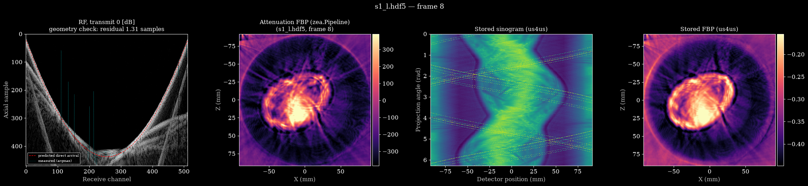

# us4us Ring-Array USCT

*A left-forearm cross-section, slice 8 of [`data/s1_l.hdf5`](https://huggingface.co/datasets/nvidia/OpenH-RF/blob/main/us4us/data/s1_l.hdf5), reconstructed beside the sinogram and reference image stored in the file.*

## Dataset Description
Raw RF data acquired with the us4us Ltd. us4R system and a Draminski ring probe.

Intended for ultrasound tomographic reconstruction.

Acquisitions were performed on:
- the left and right human forearms of 8 healthy volunteers,
- a Yezitronix B-RG-1.2 breast phantom,
- a single reference slice from water only.

The forearm and phantom acquisitions comprise consecutive slices spaced 9 mm apart in depth (half of the probe elevation).

Each slice was recorded using 1024 subsequent single-element transmissions, and received by a 512-element aperture located opposite the transmitting element.

## Dataset Contributor(s)

- Ziemowit Klimonda (PI)
- Piotr Jarosik
- Jakub Rozbicki
- Piotr Karwat
- Marcin Lewandowski
- us4us Ltd. (https://us4us.eu/)

## Dataset Creation Date
09/07/2026

## License / Terms of Use

[Creative Commons Attribution 4.0 International (CC BY 4.0)](https://creativecommons.org/licenses/by/4.0/legalcode.en). Retain attribution and identify modifications when reusing the data.

## Intended Usage
Ultrasound computed tomography image reconstruction.

## Dataset Characterization
  * Data Collection Method: phantom, healthy adult human volunteers.
  * Labeling Method: N/A.
  * Acquisition system:
      - ring probe:
          - probe radius: 130mm,
          - number of elements: 1024,
          - center frequency: 2MHz,
          - sampling rate: 8125000.0,
      - us4R research system + host PC,
      - custom positioning system for subject spatial control.
  * Tx/Rx scheme:
      - the scheme consisted of 1024 transmit-receive events,
      - each event consisted of a single probe element transmitting a short pulse (1 period at 2 MHz excitation), while 512 probe elements were used for reception,
      - the 1024 transmit events were performed sequentially, with each probe element transmitting once,
      - for each transmission, the center of the receiving aperture was positioned on the opposite side of the probe relative to the transmitting element,
      - for example, for the 0th transmission, the 0th probe element transmitted, and the receiving aperture consisted of probe elements 256–767.

## Processing the Dataset

The acquisitions can be processed with the `reconstruct.py` [script](https://github.com/open-h/OpenH-RF/blob/main/datasets/us4us/reconstruct.py) as provided in the [OpenH-RF GitHub repository](https://github.com/open-h/OpenH-RF), together with the `pipeline.yaml` definition in this folder and the [zea library](https://github.com/tue-bmd/zea). The script streams the data from the Hugging Face Hub.

The script rebuilds the attenuation sinogram and filtered-backprojection image from `data/raw_data` and plots them beside the versions stored in the file. Set `ZEA_FILE` and `FRAME` (the slice) at the top of the script.

## Dataset Format

[zea v0.1.6](https://github.com/tue-bmd/zea)

All sub-datasets are provided in the ZEA file format. No preprocessing was performed on the raw channel data.

## Dataset Quantification

**Current OpenH-RF release:** 18 HDF5 files; 32.66 GB (32,658,423,808 bytes) stored; root `zea_version` **0.1.6**. Sizes include all HDF5 contents and use decimal units (MB = 10^6 bytes, GB = 10^9 bytes, TB = 10^12 bytes), not decoded-array memory or original-source download sizes.

  * Each forearm HDF5 file contains 10 slices of the subject; `yezitronix-b-rg-1.2.hdf5` contains 11 and `reference_water.hdf5` a single slice.
  * Stored HDF5 file sizes vary: 1.89 GB to 1.95 GB excluding the water reference. `reference_water.hdf5` is 183,107,584 bytes (183.11 MB).

## Subject Metadata
The dataset contains data from:
  * breast phantom Yezitronix B-RG-1.2,
  * both forearms of 8 healthy human volunteers (2 females and 6 males, age range [20, 55]),
  * water only (reference data).

## Data Validation

* The data files contain attenuation sinograms and images reconstructed from raw data using the filtered backprojection algorithm.
  * `reconstruct.py` rebuilds both from `data/raw_data` and plots them beside the stored versions (see *Processing the Dataset*).

## Known Issues
  * The following probe elements should be considered damaged: [367, 409, 457, 764, 775, 776, 368, 390, 470, 739, 792].

## Ethical Considerations
  * All human subjects were healthy adults who voluntarily participated in the measurements.
