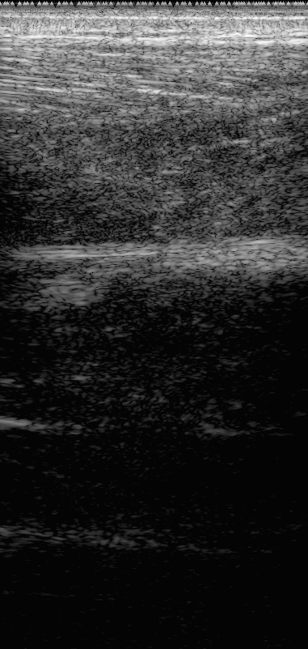

# UW-Muscle RF



*Cine loop of the relaxed left calf (lateral, longitudinal),
[`data/Acq_p35_Calf_left_calf_lateral_longitudinal_relaxed_pressure.hdf5`](https://huggingface.co/datasets/nvidia/OpenH-RF/blob/main/waterloo-muscle/data/Acq_p35_Calf_left_calf_lateral_longitudinal_relaxed_pressure.hdf5),
reconstructed from the raw channel data with the `pipeline.yaml` in this folder.*

## Dataset Description

18,720 raw RF frames (plane wave; 580,320 frame-transmits) with associated speed-of-sound
(SoS) measurements, acquired in vivo by LITMUS at the University of Waterloo with a
programmable research scanner configured for high-frame-rate imaging. Images were collected
with a rigorous protocol based on landmarking according to bone markers to ensure image
consistency. This data was collected as part of the following study:

D. Xiao, P. De La Torre, M. Saif El Nasr, A. J. Y. Chee, M. Mourtzakis, and A. C. H. Yu, “LivePulse-Echo Speed-of-Sound Estimation for Quality Assessment of Large Muscles in Humans,”Ultrasound in Medicine & Biology, vol. 51, no. 11, pp. 1925–1935, Nov. 2025.

## Dataset Contributor(s)

- Hassan Nahas <hassan.nahas@uwaterloo.ca>
- Di Xiao <di.xiao@uwaterloo.ca>
- Pat de la Torre
- Adrian J.Y. Chee
- Marina Mourtzakis
- Alfred C.H. Yu <alfred.yu@uwaterloo.ca>
- LITMUS, University of Waterloo

## Dataset Creation Date

07/12/2026

## License / Terms of Use

[Creative Commons Attribution 4.0 International (CC BY 4.0)](https://creativecommons.org/licenses/by/4.0/legalcode.en).
Retain attribution and identify modifications when reusing the data.

## Intended Usage

Developing and benchmarking methods for ultrasound image reconstruction and sound speed estimation in muscle tissue using plane wave imaging.

## Dataset Characterization

- **Data Collection Method:** In vivo imaging
- **Labeling Method:** Global speed of sound estimation for each image + Through transmission speed of sound using Olympus probe for calf.

The algorithm for global speed of sound estimation can be found here:

D. Xiao, P. D. l. Torre and A. C. H. Yu, "Real-Time Speed-of-Sound Estimation In Vivo via Steered Plane Wave Ultrasound," in IEEE Transactions on Ultrasonics, Ferroelectrics, and Frequency Control, vol. 71, no. 6, pp. 673-686, June 2024, doi: 10.1109/TUFFC.2024.3395490.


- **Acquisition system:**
Raw RF data was acquired from the US4R-Lite research scanner (US4US, Warsaw, Poland), equipped with an L14-5 linear array. For a subset of acquisitions, a through-transmission SoS estimation was made using a custom setup consisting of two single-element Olympus transducers (C567; Olympus; Tokyo, Japan).

## Processing the Dataset

The acquisitions can be processed with the `pipeline.yaml` definition in this folder and the [zea library](https://github.com/tue-bmd/zea).

`zea` streams the data from the Hugging Face Hub and processes it according to the pipeline. You can try it out with the following command:

```bash
zea process \
  --dataset hf://nvidia/OpenH-RF/waterloo-muscle/data/Acq_p35_Calf_left_calf_lateral_longitudinal_relaxed_pressure.hdf5 \
  --config hf://nvidia/OpenH-RF/waterloo-muscle/pipeline.yaml \
  --n-frames 1 \
  --save-as png
```

Alternatively, you can use the `reconstruct.py` [script](https://github.com/open-h/OpenH-RF/blob/main/datasets/waterloo-muscle/reconstruct.py) as provided in the [OpenH-RF GitHub repository](https://github.com/open-h/OpenH-RF).

Swap `--n-frames 1 --save-as png` for `--save-as gif` to get the cine loop. In the script, `ZEA_FILE` and `FRAME` at the top select what is reconstructed.

## Dataset Format

[zea v0.1.6](https://github.com/tue-bmd/zea)

Submitted in the [`zea` file format](https://zea.readthedocs.io/en/latest/)
(one HDF5 file per acquisition).

Per-sample contents of the converted HDF5:

| Group / field | Shape | Dtype | Units | Description |
|---|---|---|---|---|
| `data/raw_data` | `[1, n_tx, n_ax, n_el, 2]` | float32 | -- | Raw RF channel data |
| `data/image` | `[1, z, x]` (+ `coordinates` `[z, x, 3]`) | float32 | dB | Stored DAS B-mode (log-compressed) |
| `scan/*` | -- | -- | -- | Probe geometry, sampling/center/demod frequency, t0, sound speed, … |
| `annotations/anatomy` | `[1]` | str | -- | Muscle in view (e.g. Right Bicep) |
| `annotations/view` | `[1]` | str | -- | Longitudinal/Cross-sectional |
| `annotations/label` | `[1]` | str | -- | Label consisting of Muscle + View + Muscle State + Probe Pressure |
| `custom/estimated_global_speed_of_sound` | `[1]` | float32 | m/s | Estimated global speed of sound |
| `custom/through_tx_speed_of_sound` | `[1]` | float32 | m/s | Through Tx speed of sound (only available for calf) |
| `custom/participant_bmi` | `[1]` | float32 | kg/m^2  | Participant's body mass index |
| `custom/participant_weight` | `[1]` | float32 |  kg  | Participant's weight |
| `custom/baecke_work_index` | `[1]` | float32 |  /5  | Baecke work activity score |
| `custom/baecke_sport_index` | `[1]` | float32 |  /5  | Baecke sport activity score |
| `custom/baecke_leisure_index` | `[1]` | float32 |  /5  | Baecke leisure activity score |
| `custom/baecke_score` | `[1]` | float32 |  /15  | Total baecke score |
All `coordinates` arrays are per-pixel Cartesian positions in metres, last axis
`[x, y, z]` (y = 0 for these 2-D maps).

## Dataset Quantification

**Current OpenH-RF release:** 1,248 HDF5 files; 576.19 GB (576,186,417,152 bytes) stored; root `zea_version` **0.1.6**. Sizes include all HDF5 contents and use decimal units (MB = 10^6 bytes, GB = 10^9 bytes, TB = 10^12 bytes), not decoded-array memory or original-source download sizes.

Data was collected from 39 participants, each with 32 unique images spanning calf/bicep/quad, axis and muscle state. For each imaging location, 15 frames were made per limb under minimal contact and with pressure. Given that each frame consisted of 31 steered plane waves, our protocol yielded a total of 15 repeats × 31 transmits × 8 views × 2 sides × 2 pressure settings = 14,880 frame-transmits per participant, i.e. 480 stored frames per participant. In total the dataset contains 18,720 stored frames and 580,320 frame-transmits (see the table below).

All 1,248 HDF5 files are uploaded; current stored size and format version are reported above.

## Subject Metadata

| Metric | Value |
| :--- | :--- |
| **Total Number of Subjects** | 39 |
| **Total Number of Files** | 1248 |
| **Sex Composition** | M: 21 (53.8%), F: 18 (46.2%) |
| **Age (years)** | 30.4 ± 10.5 |
| **BMI (kg/m²)** | 24.56 ± 4.65 |
| **Weight (kg)** | 71.6 ± 15.9 |
| **Baecke Activity Score** | 8.31 ± 1.39 |
| **Total Frames (n_frames)** | 18,720 |
| **Total Frame-Transmits (n_frames x n_tx)** | 580,320 |

## Data Validation

`reconstruct.py` builds a `zea.Pipeline` of DAS beamforming →
envelope detection → normalization → log-compression **in code** and reconstructs
a B-mode directly from `raw_data` — showing the raw-to-image flow without any
config file. It also saves the pipeline to `pipeline.yaml` as a
shareable recipe. Comparing the reconstruction against the stored B-mode is a
sanity check that the acquisition parameters and probe geometry are recorded
correctly, and serves as a reproducible reference reconstruction.

## Known Issues
- Scan.sound_speed uses default 1540 m/s used for computing tx delays as was done during acquisition. This is different from the estimated global speed of sound which is currently stored as a custom element.
- Some of the participants here have been recruited for other UWaterloo datasets.
- The US4R-lite scanner used here is capable of 128 Tx/64 Rx. To fully collect all 128 channels in the L14-5 probe used here, the scanner transmits twice, receiving on the first 64 channels, then the second 64 channels to form a full RF frame. The PRF recorded here is the effective after taking into account this procedure.

## Ethical Considerations

This human study was approved by the University of Waterloo’s Human Research Ethics Board (ORE #44778). All included data was acquired from participants who provided both written and verbal consent prior to participating in the study regarding public data sharing.

## Citation

```bibtex
@article{XIAO20251925,
title = {Live Pulse-Echo Speed-of-Sound Estimation for Quality Assessment of Large Muscles in Humans},
journal = {Ultrasound in Medicine & Biology},
volume = {51},
number = {11},
pages = {1925-1935},
year = {2025},
issn = {0301-5629},
doi = {https://doi.org/10.1016/j.ultrasmedbio.2025.06.013},
url = {https://www.sciencedirect.com/science/article/pii/S0301562925002091},
author = {Di Xiao and Pat {De la Torre} and Malak {Saif El Nasr} and Adrian J.Y. Chee and Marina Mourtzakis and Alfred C.H. Yu},
keywords = {Speed-of-sound, Body-mass index, Real-time imaging, Muscle quality, Physical activity},
}
```
