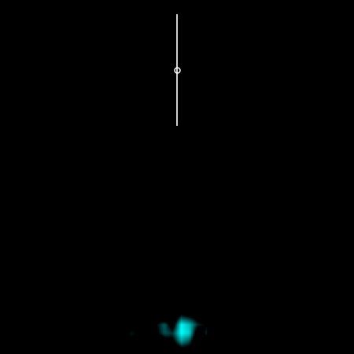
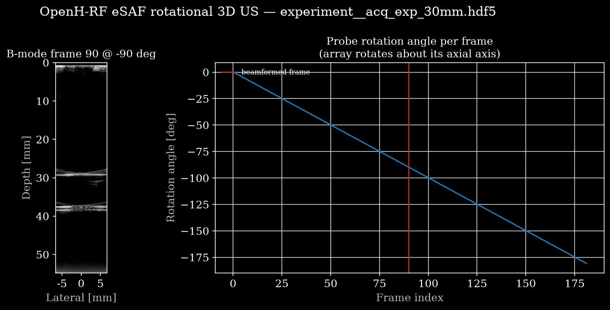
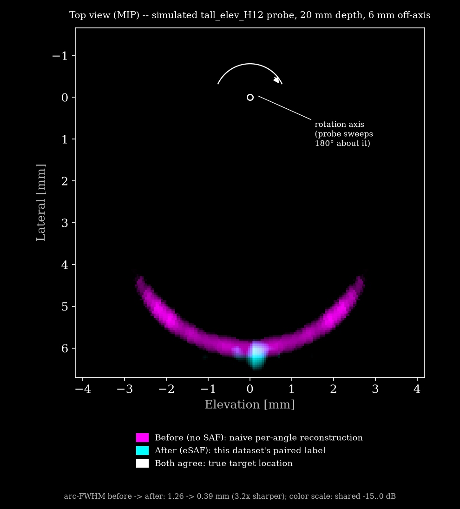

# Rotational 3D Ultrasound Raw Channel Data for Elevational SAF

<p align="center"></p>

*Top view down the rotation axis of a point target at 20 mm depth, 6 mm off-axis,
[`data/tall_elev_H12__point_z020_r6.hdf5`](https://huggingface.co/datasets/nvidia/OpenH-RF/blob/main/wpi/data/tall_elev_H12__point_z020_r6.hdf5).
Magenta is the naive per-angle reconstruction, filling in as the array (white line) sweeps
180° about the rotation axis (small circle); cyan is the paired eSAF label shipped in the file;
white is where both agree. eSAF collapses the rotational smear arc back onto the target
(arc-FWHM 1.26 → 0.39 mm).*

## Dataset Description

Rotational 3D ultrasound acquisitions of point, pair and off-axis targets, captured with an
**elevation-focused 1D linear array rotated 180° about its axial axis** (1° steps). Each
acquisition stores the **raw per-element channel RF** of a single normal plane-wave transmit at
every rotation angle, i.e. the data before in-plane beamforming, which enables flexible offline
beamforming and **elevational Synthetic Aperture Focusing (eSAF)**. Every file also carries the
eSAF-reconstructed 3D volume as a paired label.

The release is mostly **simulated (Field II)**: a grid of 10 probe types × 19 targets spanning
depths where the elevational beam thickness (the artifact eSAF corrects) varies. It is
complemented by 5 **measured phantom** rotational scans with the physical Japan Probe 68-element
array (same geometry as the simulation) at 10–45 mm depth. No human or animal subjects.

## Dataset Contributor(s)

- Ryo Murakami (contact)
- Medical FUSION Laboratory, Worcester Polytechnic Institute

## Dataset Creation Date

06/15/2026

## License / Terms of Use

[Creative Commons Attribution 4.0 International (CC BY 4.0)](https://creativecommons.org/licenses/by/4.0/legalcode.en).
Retain attribution and identify modifications when reusing the data.

## Intended Usage

Advanced beamforming and **elevational resolution recovery** for rotational 3D US (eSAF),
elevation-PSF / aperture-growth studies, and a reproducible raw-channel-data benchmark for
rotational synthetic-aperture reconstruction.

## Dataset Characterization

- **Data Collection Method:** synthetic and phantom.
  - *Simulated (190):* Field II (MATLAB, `xdc_focused_array` + `calc_scat_multi`), scatterers
    rotated about the axial axis with the transducer fixed. **10 probe types** vary lateral
    aperture (`n_el` 32/68/128, pitch 0.1/0.2/0.3 mm), elevation height `H` (4/8/12 mm) and
    elevation focus `R` (25/45/90 mm or unfocused), encoded in the probe name
    (`tall_elev_H12` = `H` 12 mm; `baseline_R45_H8` = `R` 45 mm, `H` 8 mm) and in `probe/*`.
  - *Measured (5):* rotational scans of the Japan Probe 68-element array on a wire/point
    phantom with a Galil-controlled 180° rotation, acquired as 7-angle CPWC, time-tag-synced
    to the motor angles and reduced to the centre (0°) plane wave per angle to match the
    simulation schema.
- **Labeling Method:** synthetic ground truth. Target positions are exact, and each file's
  `description` attribute records probe and target, e.g.
  `probe=tall_elev_H12 target=point_z020_r6 r0=6.0mm z=20.0mm`. The paired eSAF volume
  (`custom/saf_bmode`) is the label.
- **Acquisition system:** Japan Probe JP_Linear_68 (baseline): 68 elements, pitch 0.2 mm,
  element width 0.15 mm, element height 8 mm, elevational lens focus 45 mm; center frequency
  10 MHz; sampling 40 MHz; sound speed 1490 m/s; one normal plane-wave transmit per rotation
  angle; 180° rotation in 1° steps. Parameters match the paper simulation.

## Processing the Dataset

The acquisitions can be processed with the `reconstruct.py` [script](https://github.com/open-h/OpenH-RF/blob/main/datasets/wpi/reconstruct.py) as provided in the [OpenH-RF GitHub repository](https://github.com/open-h/OpenH-RF), together with the `pipeline.yaml`
definition in this folder and the [zea library](https://github.com/tue-bmd/zea). The script
streams the data from the Hugging Face Hub, beamforms the rotation frame closest to ±90°
(where an off-axis target lies in-plane) and plots it beside the per-frame rotation angle from
`metadata/probe_pose`. Set `ZEA_FILE` and `FRAME` at the top of the script to pick another
acquisition or frame. The default, frame 90 (~−90°) of
[`data/experiment__acq_exp_30mm.hdf5`](https://huggingface.co/datasets/nvidia/OpenH-RF/blob/main/wpi/data/experiment__acq_exp_30mm.hdf5), gives:

<p align="center"></p>

The rotational eSAF itself (in-plane DAS → `recon_3d` → `safrot_backproj`) is the published
MATLAB implementation; its output is shipped in every file as `custom/saf_bmode`:

```python
with zea.File("data/baseline_R45_H8__point_z080_r4.hdf5") as f:
    saf = {e.name: e for e in f.custom}  # custom/saf_bmode elements
    volume_db = saf["values"].data  # (1, z, x, y) float32 dB
    coordinates = saf["coordinates"].data  # (z, x, y, 3) float32 m
    print(saf["values"].description)  # axes + eSAF parameters + arc-FWHM
```

## Dataset Format

[zea v0.1.6](https://github.com/tue-bmd/zea)

One zea HDF5 file per acquisition, single track. The raw channel RF and scan parameters are in
the standard data/scan groups (`tracks/track_0`); the probe rotation per frame is the
**`metadata/probe_pose`** trajectory (`euler_xyz`, radians, rotation in the z component,
zero translation; `sampling_frequency = 1.0 Hz` is nominal, one pose per frame).

The paired eSAF label is the zea custom field **`custom/saf_bmode`**: `values` is
`(1, z, x, y)` float32 in dB (0 dB = volume max, empty pixels −inf) over a ±2 mm depth window
about the target, and `coordinates` holds the per-pixel `[x, y, z]` in metres. It lives in
`custom` rather than the data group because it is a single frame, while `raw_data` has ~180.
The per-case arc-FWHM before/after is in the `description` of `custom/saf_bmode/values`.

Pre-processing: none for the simulations beyond the forward model; for the measured scans,
frame-to-angle synchronisation, per-angle dwell averaging and centre-plane-wave selection.
Both remain raw per-element RF (not demodulated or decimated).

## Dataset Quantification

**Current OpenH-RF release:** 195 HDF5 files; 1.87 GB (1,870,462,976 bytes) stored; root `zea_version` **0.1.6**. Sizes include all HDF5 contents and use decimal units (MB = 10^6 bytes, GB = 10^9 bytes, TB = 10^12 bytes), not decoded-array memory or original-source download sizes.

- **Acquisitions:** **195** = **190 simulated** + **5 measured phantom**.
  - *Simulated (190):* **10 probe types × 19 targets** (16 single points over depth
    {20,45,80,130} mm × radial offset from the rotation centre {0,2,4,6} mm, plus 3
    pair/oblique cases). The probe axis is listed above under Data Collection Method;
    each file's own `description` attribute gives its exact probe/target/r0/depth. (The
    earlier compatible set has 18 acquisitions.)
  - *Measured (5):* real rotational phantom scans at nominal depths {10,20,30,40,45} mm
    (`experiment__acq_exp_*.hdf5`), centre plane wave, ~182 measured rotation angles
    over ~180°.
- **Frames per acquisition:** simulated 180 (one per 1° step); measured ~182 (the
  actual encoder angles are stored in `metadata/probe_pose` — z Euler component,
  radians — not necessarily uniform).
- **Stored HDF5 size:** 1.87 GB (1,870,462,976 bytes), including the paired `saf_bmode` label volumes.
- **Train/val/test split:** N/A (benchmark / characterization set; the probe × depth ×
  radius axes are the intended study dimensions).

### Per-sample feature table
Shapes use placeholders because dimensions vary across the probe grid and between
simulated and measured scans: **`n_frames`** = 180 (simulated, one per 1° step) or
~182 (measured encoder angles); **`n_el`** ∈ {32, 68, 128} (probe grid; 68 for the
baseline and all measured scans); **`n_ax`** = axial sample count (per case);
**`n_z`** = depth samples of the label volume (target ± ~2 mm window).

Paths below are inside each `.hdf5`; with `zea.File` use `f.data` / `f.scan` /
`f.metadata.probe_pose`, and `f.custom` for the SAF label volume.

| field (HDF5 path)                 | shape                          | dtype   | units | description |
|-----------------------------------|--------------------------------|---------|-------|-------------|
| `tracks/track_0/data/raw_data` (`f.data.raw_data`) | (n_frames, 1, n_ax, n_el, 1) | float32 | a.u. | raw per-element channel RF; dims = (frame=rotation, tx, axial, element, ch) |
| `probe/probe_geometry`            | (n_el, 3)                      | float32 | m     | element positions (lateral x, 0, 0) |
| `tracks/track_0/scan/sampling_frequency` | scalar                  | float32 | Hz    | 4.0e7 |
| `tracks/track_0/scan/center_frequency`   | scalar                  | float32 | Hz    | 1.0e7 |
| `tracks/track_0/scan/demodulation_frequency` | scalar              | float32 | Hz    | 1.0e7 (= center frequency; used by the reference pipeline's demodulate op) |
| `tracks/track_0/scan/sound_speed` | scalar                         | float32 | m/s   | 1490 |
| `tracks/track_0/scan/initial_times` | (1,)                         | float32 | s     | t0 (first-sample time) |
| `tracks/track_0/scan/t0_delays`   | (1, n_el)                      | float32 | s     | transmit delays (0; normal plane wave) |
| `tracks/track_0/scan/polar_angles` | (1,)                          | float32 | rad   | transmit steering (0) |
| `metadata/probe_pose/rotation`    | (n_frames, 3)                  | float32 | rad   | probe pose per frame, `euler_xyz`; rotation about the axial (z) axis is the z component |
| `metadata/probe_pose/translation` | (n_frames, 3)                  | float32 | m     | probe tip translation (all zero — pure rotation) |
| `metadata/probe_pose/sampling_frequency` | scalar                  | float32 | Hz    | 1.0 — **nominal** one-pose-per-frame rate, not a physical value |
| `metadata/credit` (`f.metadata.credit`) | scalar                   | str     | –     | dataset credit / attribution (lab, contact, citation, license) |
| `metadata/subject/type` (`f.metadata.subject.type`) | scalar       | str     | –     | `simulated phantom` (Field II sims) or `phantom` (measured `experiment__*` scans) |
| `custom/saf_bmode/values` (custom field, via `f.custom`) | (1, n_z, n_el, n_el) | float32 | dB | **paired label**: elevational-SAF reconstructed 3D B-mode volume, log-compressed normalized envelope (0 dB = max, empty pixels −inf); dims = (frame, z=depth, x=lateral, y=elevation) |
| `custom/saf_bmode/coordinates` | (n_z, n_el, n_el, 3)             | float32 | m     | per-pixel `[x, y, z]` positions of the label volume (target ± ~2 mm depth window) |

## Subject Metadata

No human or animal subjects / no PHI. Each file stores `metadata/subject/type`:
`simulated phantom` for the Field II simulations, `phantom` for the measured
`experiment__*` scans. Creator attribution is stored per file in `metadata/credit`.

## Data Validation

`reconstruct.py` beamforms a single rotation frame with the `pipeline.yaml` chain
(Cast → Demodulate → Beamform(delay_and_sum) → EnvelopeDetect → Normalize → LogCompress) and
plots the stored rotation trajectory beside it, as a check on the acquisition parameters and
the frame-to-angle mapping.

The eSAF labels were checked per case with the arc-FWHM of the rotational smear before and
after eSAF, shown here annotated for the case in the hero image:

<p align="center"></p>

## Known Issues

- **Paired SAF label — on-axis targets (r0 = 0) do not narrow, by design.** eSAF
  refocuses the *rotational elevation smear*; a target sitting on the rotation axis has
  essentially no smear, so its `saf_bmode` label volume is not sharper than the input (arc-FWHM
  gain ≈ 1). This is expected physics, not a defect — the 40 on-axis cases (median gain
  1.00×) are included so the pair covers the degenerate no-smear case. Off-axis targets
  (n=120, median gain 1.75×, up to ~12×) and paired/oblique targets (n=30, median 3.71×)
  improve clearly; targets at the focal depth (~45 mm) and weak-elevation-focus probes
  (`efocus_deep_90`, `elev_unfocused`) have less smear to recover. Across all 195 cases,
  median arc-FWHM gain is 1.36× (42 cases < 1×, mostly the on-axis/near-focus group above).
  Arc-FWHM is measured on a **centred** reconstruction: the smear circle passes through both
  the rotation axis and the target (not a circle centred on the rotation axis). The eSAF
  back-projection uses a fixed elevational focus of 45 mm; per-depth focus tuning (see
  `docs/eSAF_focus_depth_study_JP.md`, source) can further sharpen deep off-axis cases but was
  not applied here (single as-designed focus).
- **Measured phantom depth window.** The real reflector bead sits **~4 mm off the rotation
  axis** (not on-axis) and, for each scan, slightly deeper than the folder's nominal depth
  label; labels are reconstructed over the interactively-identified reflector depth window
  (not a naive nominal-depth ± 2 mm window), which matters because a mis-centred window can
  pick up near-axis clutter instead of the actual bead.
- **Simulated** data (Field II spatial-impulse-response model): realistic transducer
  field, but no tissue attenuation, aberration, multiple scattering, or electronic
  noise. Not a substitute for measured data.
- Speed of sound is 1490 m/s, matching the paper Table 1 and the experiment.
- A single normal plane-wave transmit per rotation angle is simulated (the dataset
  stores n_tx = 1); multi-angle compounding is left to downstream users.
- **Measured scans:** acquired as 7-angle CPWC; only the **centre (0°) plane wave** is
  kept here to match the n_tx = 1 schema. The dwell frames per angle are averaged before
  storage (noise reduction). Real reflectors are not ideal point scatterers — expect
  reverberation/clutter near the surface and specular layering; rotation angles are the
  measured encoder values (slightly non-uniform, full span ≈ 180°, sign per encoder
  direction). The elevational lens focus is the nominal 45 mm, but the effective
  back-projection focus for eSAF is depth-dependent on real data (see
  `docs/eSAF_focus_depth_study_JP.md`, source).

## Ethical Considerations

None. The data is either fully synthetic (Field II) or measured on an inanimate phantom: no
human or animal subjects, no PHI, no consent or IRB constraints.

## Raw Source Data

The raw pre-conversion outputs are archived under the same CC BY 4.0 license at
<https://huggingface.co/datasets/RyoMurakami/OpenH-RF-eSAF-raw>: the raw Verasonics per-line
channel-RF captures (with encoder logs) for the 5 measured acquisitions, and the per-case MATLAB
intermediates (raw RF, in-plane DAS, eSAF output) for the 190 simulated cases.

## Citation

When using this dataset, please cite:

> R. Murakami et al., "Elevational Synthetic Aperture Focusing for Rotated
> Array-Based Three-Dimensional Ultrasound Imaging," IEEE Access, 2025.
